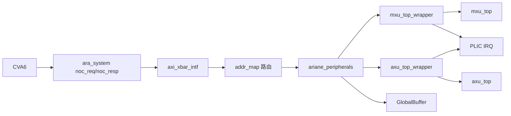
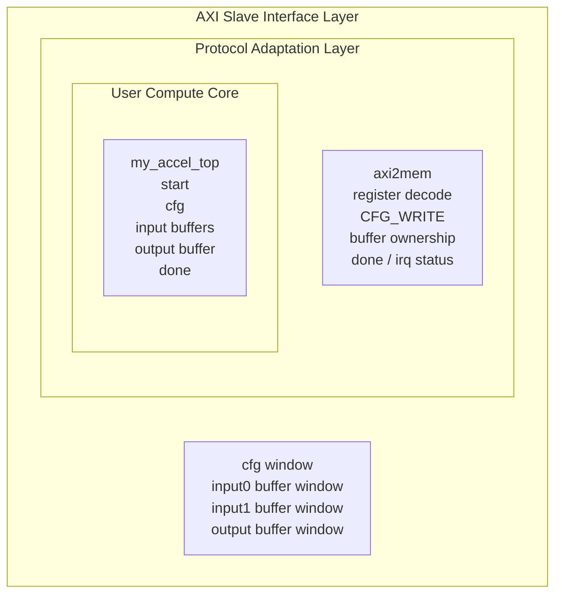

# 阶段一：如何修改 hardware 文件夹，把自定义硬件接到 CVA6 的 AXI 总线

本文是“往 CPU 的 AXI 总线上加自定义模块”系列教程的第 1 篇。
它不再只面向 MXU，而是总结当前最新前端设计中，把任意自定义硬件模块挂到 CVA6 AXI 总线上的通用方法。

当前最新主线是 `minimum_my_mxu_axu`：同一个 SoC 变体中已经集成 MXU、AXU、GlobalBuffer 和 iDMA。

MXU、AXU 在本文中只是两个例子；真正需要掌握的是 AXI/MMIO wrapper 型外设接入方法。

本文只讲 hardware 和 filelist，不讲 C 驱动、不讲测试数据转换。

软件部分见 `如何修改softwareware文件夹下的内容？.md`，测试数据和脚本见 `如何准备测试数据和测试脚本？.md`。

## 0. 文档适用范围

本文适用于这类自定义硬件：

1. 原始计算核心不是标准 AXI slave。
2. CPU 通过 load/store 访问固定物理地址来配置、启动、读写 buffer。
3. 自定义模块外面包一层 AXI/MMIO wrapper。
4. wrapper 内部把 AXI slave 请求转换为寄存器访问或 SRAM-like buffer 访问。

当前 MXU 和 AXU 都属于这种模式。它们不是通过 CV-X-IF 自定义指令路径接入，而是 memory-mapped accelerator。

需要区分几个 SoC 变体：

| 变体 | 定位 | 说明 |
|---|---|---|
| `minimum_my_mxu` | 早期 MXU-only 版本 | 适合回看单模块接入过程 |
| `minimum_my_mxu_axu` | 当前最新主线 | 同时包含 MXU、AXU、GlobalBuffer、iDMA |
| `minimum_asic_dma` / `minimum_vmma_dma` | 早期/并行 DMA 型探索 | 可参考，但不要和本文 MMIO buffer 型流程混用 |

后续新增模块时，优先参照 `minimum_my_mxu_axu` 的组织方式。

## 1. 总体架构、通用模型与实施顺序

本节先给出完整路线图。读者在进入具体文件修改前，应该先理解三件事：CPU 访问自定义硬件的总路径、一个模块应该抽象成哪些 AXI 窗口、以及新增模块时推荐按什么顺序推进。

### 1.1 CPU 访问自定义硬件的总体路径

当前 CVA6 访问自定义硬件的路径如下：



核心文件是：

| 文件 | 作用 |
|---|---|
| `hardware/soc/minimum_my_mxu_axu/ariane_soc_pkg.sv` | 定义 xbar 上游 master、下游 slave/peripheral、base、length |
| `hardware/soc/minimum_my_mxu_axu/ariane_soc_top.sv` | 配置 `addr_map`，实例化 `axi_xbar_intf`，连接 `master[]` 与 peripherals |
| `hardware/soc/minimum_my_mxu_axu/ariane_peripherals.sv` | 实例化 MXU、AXU、GlobalBuffer、DMA、PLIC 等外设 |
| `hardware/user_ip/my_mxu/mxu_top_wrapper.sv` | MXU 的 AXI/MMIO wrapper |
| `hardware/user_ip/my_axu/axu_top_wrapper.sv` | AXU 的 AXI/MMIO wrapper |
| `hardware/soc/filelist_minimum_my_mxu_axu.f` | 当前 SoC RTL filelist |
| `hardware/soc/filelist_syn_minimum_my_mxu_axu.f` | 当前综合侧 filelist |

### 1.2 先抽象访问模型：cfg + buffer 窗口

对任意一个新加速器，推荐先按“1 个 cfg + N 个 buffer”的方式抽象。MXU/AXU 采用的是 4 窗口模板：

| 通用窗口 | MXU 示例 | AXU 示例 | 用途 |
|---|---|---|---|
| `cfg` | `MxuCfg` | `AxuCfg` | 控制寄存器、状态寄存器、内部 cfg 写入、IRQ |
| `input0` | `MxuWgtBuf` | `AxuOpABuf` | 输入 buffer 0 |
| `input1` | `MxuActBuf` | `AxuOpBBuf` | 输入 buffer 1 |
| `output` | `MxuOutBuf` | `AxuOutBuf` | 输出 buffer |

不是所有模块都必须有 4 个窗口。简单外设可以只有一个 cfg 窗口；更复杂模块可以有更多 buffer 窗口。但文档、硬件、软件、测试脚本都必须围绕同一个窗口契约展开。

### 1.3 新增任意模块的推荐实施顺序

假设要新增一个 `my_accel`，推荐按下面顺序推进：

1. 明确模块访问模型：需要几个 AXI 窗口、每个窗口大小、是否需要中断、是否需要 DMA master。
2. 编写 `my_accel_top_wrapper.sv`：把 AXI cfg/buffer port 转为内部控制和 SRAM-like 访问。
3. 在 `ariane_soc_pkg.sv` 添加 enum、base、length，更新 `NB_PERIPHERALS`。
4. 在 `ariane_soc_top.sv` 添加 `addr_map` 规则，并把 `master[MyAccel*]` 接到 peripherals。
5. 在 `ariane_peripherals.sv` 添加端口、实例化 wrapper、连接 irq。
6. 更新 filelist。
7. 写最小 C 程序，只读 status 或写读 cfg 寄存器，确认地址通。
8. 再写输入 buffer、cfg、start、wait done、读输出。
9. 最后接入完整数据生成和回归脚本。

不要一开始就把完整模型、完整数据、DMA、中断、后仿全部混在一起调。更稳妥的路线是：先定访问模型，再写 wrapper，再接 SoC，再做最小软件验证，最后才进入完整数据和回归脚本。

### 1.4 本文后续章节如何展开

后续章节会按这个实施顺序展开：先说明当前 `minimum_my_mxu_axu` 的地址空间，再分别说明 package 枚举、top 层 `addr_map`、`ariane_peripherals`、wrapper、buffer ownership、filelist，最后给出 checklist 和常见问题排查。

## 2. 当前 `minimum_my_mxu_axu` 地址空间

当前组合变体中，自定义外设集中放在 `0x6000_0000` 和 `0x7000_0000` 之后：

| 外设窗口 | xbar enum | base | size | 用途 |
|---|---:|---:|---:|---|
| iDMA cfg | `DMA` | `0x6000_0000` | `0x1000` | desc64 DMA 配置口 |
| MXU cfg | `MxuCfg` | `0x7000_0000` | `0x1000` | MXU 控制/状态/cfg/IRQ |
| MXU weight buffer | `MxuWgtBuf` | `0x7000_8000` | `0x8000` | MXU weight buffer |
| MXU activation buffer | `MxuActBuf` | `0x7001_0000` | `0x8000` | MXU activation buffer |
| MXU output buffer | `MxuOutBuf` | `0x7001_8000` | `0x8000` | MXU output buffer |
| AXU cfg | `AxuCfg` | `0x7002_0000` | `0x1000` | AXU 控制/状态/cfg/IRQ |
| AXU op_a buffer | `AxuOpABuf` | `0x7002_8000` | `0x8000` | AXU operand A |
| AXU op_b buffer | `AxuOpBBuf` | `0x7003_0000` | `0x8000` | AXU operand B |
| AXU output buffer | `AxuOutBuf` | `0x7003_8000` | `0x8000` | AXU output buffer |
| GlobalBuffer | `GlobalBuffer` | `0x7004_0000` | `0x8000` | DMA/软件共享缓冲 |

这些地址在硬件侧来自 `hardware/soc/minimum_my_mxu_axu/ariane_soc_pkg.sv`，软件侧必须在 `software/soc/include/*.h` 中完全镜像。地址不能只改一边。

## 3. 第一步：在 `ariane_soc_pkg.sv` 中增加 xbar 下游端口

`ariane_soc_pkg.sv` 里有两个枚举：

1. `axi_masters_t`：表示进入 xbar 的上游 requester。当前包括 CVA6、Debug、DMA master。
2. `axi_slaves_t`：表示 xbar 下游可访问的 peripheral/slave port。

当前 `minimum_my_mxu_axu` 中，自定义模块相关的下游端口是：

```text
MxuCfg       = 9
MxuWgtBuf    = 10
MxuActBuf    = 11
MxuOutBuf    = 12
AxuCfg       = 13
AxuOpABuf    = 14
AxuOpBBuf    = 15
AxuOutBuf    = 16
DMA          = 17
GlobalBuffer = 18
NB_PERIPHERALS = 19
```

新增模块时需要：

1. 给每个 AXI slave 窗口分配一个 enum。
2. 更新 `NB_PERIPHERALS`。
3. 增加每个窗口的 `Length`。
4. 增加每个窗口的 `Base`。
5. 确认 `ValidRule` 的宽度跟 `NB_PERIPHERALS` 匹配。

常见错误：只增加了 base，却忘了增加 enum；或增加了 enum，却忘了更新 `NB_PERIPHERALS`。

## 4. 第二步：在 `ariane_soc_top.sv` 中配置 xbar 地址路由

`ariane_soc_top.sv` 负责把地址窗口真正喂给 `axi_xbar_intf`。

对每个外设窗口，都要在 `addr_map` 中加入规则：

```text
idx        = 对应 axi_slaves_t enum
start_addr = Base
end_addr   = Base + Length
```

理解成半开区间更安全：`[start_addr, end_addr)`。例如 `MxuCfgBase=0x7000_0000`、`MxuCfgLength=0x1000`，则有效范围是 `0x7000_0000` 到 `0x7000_0fff`。

新增模块时，检查三件事：

1. `addr_map` 中的 `idx` 与 `ariane_soc_pkg.sv` enum 一致。
2. `start_addr/end_addr` 与 package 中 base/length 一致。
3. `axi_xbar_intf` 的 slave/master 数量参数没有被旧值卡住。

## 5. 第三步：扩展 `ariane_peripherals.sv`

`ariane_peripherals.sv` 是 SoC 外设汇聚层。新增模块时通常要做两类改动：

1. 在端口列表中增加 AXI slave port。
2. 在模块体内实例化 wrapper，并把 AXI port、clock、reset、irq 接好。

当前 MXU 实例化方式是：

```text
mxu_top_wrapper
  .clk_i(clk_i)
  .rst_ni(rst_ni)
  .cfg(mxu_cfg)
  .wgtbuf(mxu_wgt)
  .actbuf(mxu_act)
  .outbuf(mxu_out)
  .irq_o(irq_sources[2])
```

当前 AXU 实例化方式是：

```text
axu_top_wrapper
  .clk_i(clk_i)
  .rst_ni(rst_ni)
  .cfg(axu_cfg)
  .op_a_buf(axu_opa)
  .op_b_buf(axu_opb)
  .out_buf(axu_out)
  .irq_o(irq_sources[1])
```

新增模块时，如果需要中断，必须同时确认：

| 硬件信号 | 软件含义 |
|---|---|
| `irq_sources[i]` | PLIC source index |
| `IRQn = i + 1` | 软件侧 PLIC interrupt id |

当前约定：AXU 使用 `irq_sources[1]`，软件 IRQn 为 2；MXU 使用 `irq_sources[2]`，软件 IRQn 为 3；DMA 使用 `irq_sources[7]`，软件 IRQn 为 8。

## 6. 第四步：设计 AXI/MMIO wrapper

wrapper 是最关键的边界层。它的任务不是实现计算，而是把 SoC AXI 总线协议转换成计算核心容易使用的控制接口和 buffer 访问接口。

MXU/AXU wrapper 可以理解为三层嵌套结构：最外层是 SoC 看到的 AXI slave interface，中间层是负责协议转换和控制封装的 protocol adaptation layer，最内层才是真正的用户自定义计算核心。



推荐 wrapper 至少提供这些功能：

| 功能 | 说明 |
|---|---|
| `CTRL.START` | 软件写 1 后产生单周期 `start_pulse` |
| `CTRL.CLR_DONE` | 清除 done sticky 和 irq sticky |
| `STATUS.BUSY` | 返回核心 busy 状态 |
| `STATUS.DONE` | 返回 sticky done 状态 |
| buffer control | 控制每个 buffer 的读端/写端属于 CPU 还是加速器 |
| `CFG_WRITE` | 软件写内部 cfg address/data，wrapper 产生 `cfg_set_pulse` |
| `IRQ_MASK/IRQ_STAT` | 支持 done 中断屏蔽和清除 |

当前 MXU/AXU 的 `CFG_WRITE` 约定为：

```text
bit [3:0]   cfg_addr
bit [15:8]  cfg_data
```

也就是说内部 cfg address 只有 4 bit，cfg data 只有 8 bit。未来如果新模块需要更宽配置，必须同步修改 wrapper、核心和软件头文件，不能只改 C 宏。

## 7. 第五步：定义 buffer ownership 协议

新增 AXI/MMIO 加速器时，必须明确 CPU 和加速器在不同阶段分别拥有哪些 buffer 读写端口。MXU/AXU 的 buffer 都不是普通 DRAM，而是加速器内部 SRAM-like buffer，CPU 和加速器不能随意同时占用读写端口。

当前 buffer control 的通用含义是：

| bit | 含义 |
|---:|---|
| bit0 | 读端口交给加速器 |
| bit1 | 写端口交给加速器 |

典型顺序是：

1. 初始化阶段：所有 buffer 端口归 CPU。
2. CPU 写输入 buffer。
3. CPU 写 cfg。
4. 运行阶段：输入 buffer 的读端交给加速器，输出 buffer 的写端交给加速器。
5. 等 done。
6. 结果读取阶段：输出 buffer 切回 CPU。

如果 ownership 错了，常见现象是：

- AXI 写输入成功，但核心读不到。
- 核心 done 了，但 CPU 读到的 output 仍然是 0 或 poison 值。
- 部分 bank 正确、部分 bank 错误。
- 仿真中出现 X 或长期 timeout。

## 8. 第六步：更新 SoC、仿真和综合 filelist

新增 RTL 后，必须把 wrapper、计算核心和相关 SoC 文件加入对应 filelist；否则仿真和综合都不会看到它。当前组合变体相关 filelist 包括：

| 文件 | 用途 |
|---|---|
| `hardware/soc/filelist_minimum_my_mxu_axu.f` | SoC 级 RTL 仿真/构建入口 |
| `hardware/soc/filelist_syn_minimum_my_mxu_axu.f` | 综合侧 user IP/SoC filelist |
| `hardware/user_ip/my_mxu/filelist_mxu_top_syn.f` | MXU 内部 RTL filelist |
| `hardware/user_ip/my_axu/filelist_axu_top_syn.f` | AXU 内部 RTL filelist |
| `sim/filelist_minimum_my_mxu_axu.f` | 仿真目录侧引用入口 |

经验规则：app、SoC 变体、filelist 必须匹配。AXU app 不能拿只包含 MXU 的 filelist 跑；组合 SoC 也不要误引用旧 `minimum_my_mxu` 地址表。

## 9. 第七步: 按照 checklist 进行检查

- [ ] 新模块有清晰的 AXI 窗口划分。
- [ ] `ariane_soc_pkg.sv` 中 enum、base、length、`NB_PERIPHERALS` 一致。
- [ ] `ariane_soc_top.sv` 中 `addr_map` 覆盖所有窗口，且不重叠。
- [ ] `ariane_soc_top.sv` 中 xbar `master[]` 端口接到了 `ariane_peripherals`。
- [ ] `ariane_peripherals.sv` 端口名、实例化名、wrapper port 名一致。
- [ ] reset 极性统一，当前 wrapper 使用低有效 `rst_ni`。
- [ ] irq source 没有和已有外设冲突。
- [ ] wrapper 的寄存器 offset 与软件头文件一致。
- [ ] buffer ownership 协议已经写入软件驱动。
- [ ] RTL 已加入 SoC、user IP、仿真、综合 filelist。
- [ ] app 使用的 filelist 是当前 SoC 变体对应 filelist。

## 10. 常见问题排查

### 12.1 CPU 访问地址无响应

优先检查：

1. 软件 base address 是否与 `ariane_soc_pkg.sv` 一致。
2. `addr_map` 是否添加该地址窗口。
3. `NB_PERIPHERALS` 是否更新。
4. `master[Enum]` 是否接入 `ariane_peripherals`。
5. wrapper 是否进入 filelist。

### 12.2 start 后一直 timeout

优先检查：

1. `CTRL` offset 是否一致。
2. `CFG_WRITE` 是否真的产生 `cfg_set_pulse`。
3. 输入 buffer ownership 是否切给加速器读端。
4. 输出 buffer ownership 是否切给加速器写端。
5. 核心 done 信号是否接回 wrapper。

### 12.3 done 了但结果不对

优先检查：

1. buffer 地址公式是否与 bank/row/half64 硬件布局一致。
2. 输出 buffer 是否在 CPU 读取前切回 CPU。
3. cfg base row、batch、mode 是否写对。
4. 数据打包脚本是否匹配硬件期望。

### 12.4 中断收不到

优先检查：

1. wrapper `irq_o` 是否接到 `irq_sources[i]`。
2. 软件 IRQn 是否使用 `i + 1`。
3. `IRQ_MASK` 是否打开。
4. `IRQ_STAT` 是否被提前清掉。
5. PLIC priority、enable、threshold 是否配置。

## 11. 本阶段结论

硬件阶段的核心不是“把 MXU 的几行代码复制出来”，而是建立一个稳定的 AXI/MMIO 外设接入模板：

```text
CVA6 -> AXI xbar -> 地址窗口 -> ariane_peripherals -> wrapper -> 自定义核心
```

MXU 和 AXU 已经证明这个模板可以复用。后续新增任意自定义模块时，只要窗口规划、地址映射、wrapper 协议、软件镜像、filelist 五件事保持一致，就可以按同一流程接入 CVA6 的 AXI 总线。
