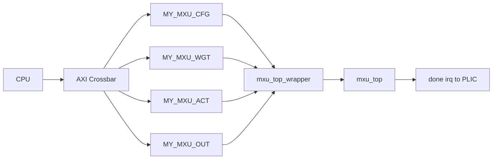

# 阶段一：如何修改 hardware 文件夹，把 MXU 接到 CPU 的 AXI 总线

本文是“往 CPU 的 AXI 总线上加自定义模块”系列教程的第 1 篇，目标是解释已经跑通的 `my_mxu` 版本中，hardware 目录到底改了什么、为什么这样改、初学者如何按步骤复现。

当前教程以 `work_for_tapeout_2026/Soc_w_ASIC-main` 中已经验证通过的版本为事实基准。该版本已经完成：

- `int_ff` 通过。
- `posit_ff` 通过。
- `posit_bp` 通过。
- 三个模式的 `compare_report.txt` 均显示 `result: PASS`。

本阶段只讲 hardware 和 sim filelist，不讲 C 驱动、不讲测试数据转换。软件部分见 `如何修改softwareware文件夹下的内容？.md`，测试数据和脚本见 `如何准备测试数据和测试脚本？.md`。

## 0. 本文最终要解决什么问题

原始 MXU 顶层来自：

`DPRL_V14_MXU/rtl/mxu_top/mxu_top.sv`

它不是标准 AXI slave。它暴露的是一组内部控制信号和三组 buffer 访问口，例如：

- `cfg_set_i`
- `cfg_addr_i`
- `cfg_data_i`
- `start_i`
- `busy_o`
- `done_o`
- `wgt_axi_req_i / wgt_axi_write_en_i / wgt_axi_addr_i / wgt_axi_wdata_i / wgt_axi_rdata_o`
- `act_axi_*`
- `out_axi_*`

CPU 不能直接访问这些 RTL 信号。CPU 只能通过 SoC 总线访问某些地址。因此 hardware 阶段的核心任务是：

1. 给 `mxu_top` 外面包一层 AXI/MMIO wrapper。
2. 在 SoC 地址空间中分配 4 个地址窗口。
3. 把这 4 个地址窗口接到 AXI crossbar。
4. 在 peripherals 里实例化 MXU wrapper。
5. 把 MXU RTL 和新 SoC 变体加入 filelist，让仿真能编译。

最终 CPU 看到的是 4 个 MMIO 区域：

| 地址窗口 | 当前跑通版本 base | 大小 | 用途 |
|---|---:|---:|---|
| `MY_MXU_CFG_BASE` | `0x70000000` | `0x1000` | 控制寄存器、状态寄存器、cfg 写入、irq |
| `MY_MXU_WGT_BASE` | `0x70008000` | `0x8000` | weight buffer |
| `MY_MXU_ACT_BASE` | `0x70010000` | `0x8000` | activation buffer |
| `MY_MXU_OUT_BASE` | `0x70018000` | `0x8000` | output buffer |

这 4 个 base 必须同时与以下文件一致：

- `hardware/soc/minimum_my_mxu/ariane_soc_pkg.sv`
- `hardware/soc/minimum_my_mxu/ariane_soc_top.sv`
- `software/soc/include/my_mxu.h`

## 1. 总体架构

接入后的硬件数据流如下：



四个 AXI slave 的分工：

1. `cfg`：CPU 访问控制寄存器，包括 START、STATUS、CFG_WRITE、IRQ。
2. `wgtbuf`：CPU 写入 weight buffer，计算时 MXU 读取。
3. `actbuf`：CPU 写入 activation buffer，计算时 MXU 读取。
4. `outbuf`：计算时 MXU 写入 output buffer，计算结束后 CPU 读取。

为什么要拆成 4 个窗口？

- cfg 寄存器是很小的控制空间，适合 4 KiB。
- 三个 buffer 各自有独立访问口，拆开后地址映射、软件驱动和排错都更清楚。
- wrapper 内部可以分别把 4 个 AXI slave 转换成 `mxu_top` 所需的简单访问口。

## 2. 当前跑通版本的硬件文件地图

重点文件如下。

一、MXU 用户 IP：

- `Soc_w_ASIC-main/hardware/user_ip/my_mxu/mxu_top_wrapper.sv`
  - 最关键文件。
  - 把 4 个 AXI slave 转换成 `mxu_top` 的 cfg/start/buffer 信号。
  - 软件寄存器 offset 必须与这里一致。

- `Soc_w_ASIC-main/hardware/user_ip/my_mxu/filelist_mxu_top_sim.f`
  - 列出 MXU wrapper、mxu_top、pdpu、stu、sram wrapper 等全部依赖。
  - 编译报 module/package 找不到时优先检查这里。

- `Soc_w_ASIC-main/hardware/user_ip/my_mxu/mxu_top/mxu_top.sv`
  - 原始 MXU 顶层。
  - SoC 中不直接把它接到 crossbar，而是由 `mxu_top_wrapper.sv` 实例化。

- `Soc_w_ASIC-main/hardware/user_ip/my_mxu/mxu_top/mxu_ctrl.sv`
- `Soc_w_ASIC-main/hardware/user_ip/my_mxu/mxu_top/mxu_top_no_ctrl.sv`
- `Soc_w_ASIC-main/hardware/user_ip/my_mxu/mxu/*.sv`
- `Soc_w_ASIC-main/hardware/user_ip/my_mxu/pdpu/*.sv`
- `Soc_w_ASIC-main/hardware/user_ip/my_mxu/stu/*.sv`
- `Soc_w_ASIC-main/hardware/user_ip/my_mxu/pkgs/*.sv`
  - MXU 内部依赖。

二、SoC 变体：

- `Soc_w_ASIC-main/hardware/soc/minimum_my_mxu/ariane_soc_pkg.sv`
  - 定义 AXI slave 枚举。
  - 定义 MXU 四个地址窗口的 base 和 length。

- `Soc_w_ASIC-main/hardware/soc/minimum_my_mxu/ariane_soc_top.sv`
  - 定义 AXI crossbar 的 `addr_map`。
  - 把 `master[MxuCfg]`、`master[MxuWgtBuf]`、`master[MxuActBuf]`、`master[MxuOutBuf]` 接到 peripherals。

- `Soc_w_ASIC-main/hardware/soc/minimum_my_mxu/ariane_peripherals.sv`
  - 顶层端口增加 4 个 MXU AXI slave。
  - 实例化 `mxu_top_wrapper`。
  - 把 `irq_o` 接到 `irq_sources[2]`。

- `Soc_w_ASIC-main/hardware/soc/minimum_my_mxu/ara_system.sv`
- `Soc_w_ASIC-main/hardware/soc/minimum_my_mxu/cva6_accel_first_pass_decoder.sv`
  - 当前路线是 AXI/MMIO 外设路线，不是 custom instruction 路线。
  - 这两个文件基本保持 minimum SoC 结构，不需要把 MXU 接成 CV-X-IF 自定义指令加速器。

三、filelist：

- `Soc_w_ASIC-main/hardware/soc/filelist_minimum_my_mxu.f`
  - 引入 `minimum_my_mxu` 版本的 SoC 文件。

- `Soc_w_ASIC-main/sim/filelist_minimum_my_mxu.f`
  - 仿真入口 filelist。
  - 引入基础 IP、`filelist_minimum_my_mxu.f`、`default_slave`、`my_mxu/filelist_mxu_top_sim.f` 和 testbench。

## 3. 为什么新建 minimum_my_mxu，而不是直接改 minimum

推荐做法是复制原始 minimum SoC，形成独立变体：

`hardware/soc/minimum_my_mxu/`

这样做有三个好处：

1. 原始 `minimum/` 保持干净，后续可以作为对照。
2. MXU 接入失败时，能确认问题来自新变体，而不是把原始 SoC 改坏。
3. filelist 可以显式选择 `filelist_minimum_my_mxu.f`，便于和其他实验版本共存。

当前跑通版本实际使用的是 `minimum_my_mxu`，而不是早期草稿中写到的 `minimum_mxu`。后续软件和脚本也使用 `my_mxu` 命名。

## 4. wrapper：mxu_top_wrapper.sv 的职责

路径：

`Soc_w_ASIC-main/hardware/user_ip/my_mxu/mxu_top_wrapper.sv`

wrapper 对外提供：

- `input logic clk_i`
- `input logic rst_ni`
- `AXI_BUS.Slave cfg`
- `AXI_BUS.Slave wgtbuf`
- `AXI_BUS.Slave actbuf`
- `AXI_BUS.Slave outbuf`
- `output logic irq_o`

wrapper 对内实例化：

- 4 个 `axi2mem`。
- 1 个 `mxu_top`。

4 个 `axi2mem` 分别把 AXI slave 转成简单访存信号：

- `req`
- `we`
- `addr`
- `be`
- `wdata`
- `rdata`

其中：

- cfg 的 `axi2mem` 用于访问 wrapper 内部寄存器。
- wgt/act/out 的 `axi2mem` 用于连接 `mxu_top` 三个 buffer 访问口。

## 5. wrapper 的寄存器契约

当前跑通版本的 cfg 寄存器如下，必须与 `software/soc/include/my_mxu.h` 一致。

| offset | 名称 | 方向 | 说明 |
|---:|---|---|---|
| `0x000` | `CTRL` | W | bit0 START，bit1 CLR_DONE |
| `0x008` | `STATUS` | R | bit0 BUSY，bit1 DONE |
| `0x010` | `WGT_BUF_CTL` | R/W | bit0 读端给 MXU，bit1 写端给 MXU |
| `0x018` | `ACT_BUF_CTL` | R/W | bit0 读端给 MXU，bit1 写端给 MXU |
| `0x020` | `OUT_BUF_CTL` | R/W | bit0 读端给 MXU，bit1 写端给 MXU |
| `0x030` | `CFG_WRITE` | W | bit[3:0] cfg_addr，bit[15:8] cfg_data |
| `0x038` | `IRQ_MASK` | R/W | bit0 done irq enable |
| `0x040` | `IRQ_STAT` | R/W1C | bit0 done irq sticky，写 1 清除 |

几个关键点：

1. `START` 是脉冲。
   - CPU 写 `CTRL.START=1`。
   - wrapper 产生一个周期的 `start_pulse`。
   - 不应长期把 `start_i` 拉高。

2. `CFG_WRITE` 是写触发。
   - CPU 每写一次 `CFG_WRITE`，wrapper 产生一个周期的 `cfg_set_pulse`。
   - `cfg_addr_i = cfg_wdata[3:0]`。
   - `cfg_data_i = cfg_wdata[15:8]`。

3. `DONE` 使用 sticky 状态。
   - `mxu_top.done_o` 可能只是短脉冲。
   - wrapper 用 `done_sticky_q` 保存完成状态。
   - 软件读 `STATUS.DONE` 或 `STATUS.BUSY` 判断是否结束。

4. IRQ 当前接到了 PLIC。
   - `irq_o = irq_status_q & irq_mask_q`。
   - `ariane_peripherals.sv` 中接到 `irq_sources[2]`。
   - 软件头文件中对应 `IRQn_MY_MXU = 3`。
   - 当前测试软件主要使用轮询，不依赖中断也可以跑通。

## 6. buffer ownership 的含义

MXU 的三个 buffer 都有 CPU 访问口和 MXU 内核访问口。为了避免同一个端口同时被 CPU 和 MXU 使用，wrapper 提供了三个 buffer control 寄存器。

每个 buffer control 寄存器约定：

- bit0：读端口是否交给 MXU。
- bit1：写端口是否交给 MXU。

软件中的典型顺序是：

1. CPU 写输入数据之前：
   - `wgt`：读端 0，写端 0。
   - `act`：读端 0，写端 0。
   - `out`：读端 0，写端 0。

2. 开始计算之前：
   - `wgt`：读端给 MXU，写端不给 MXU，即 `(1,0)`。
   - `act`：读端给 MXU，写端不给 MXU，即 `(1,0)`。
   - `out`：读端不给 MXU，写端给 MXU，即 `(0,1)`。

3. 计算完成后 CPU 读输出：
   - `out` 切回 `(0,0)`。

如果 ownership 错误，常见现象是：

- DONE 有了，但 output 全 0。
- 只有部分 bank 正确。
- 计算卡住或输出 X。

## 7. 修改 ariane_soc_pkg.sv

路径：

`Soc_w_ASIC-main/hardware/soc/minimum_my_mxu/ariane_soc_pkg.sv`

这个文件定义 SoC 地址空间。当前跑通版本增加了 4 个 AXI slave：

- `MxuCfg = 10`
- `MxuWgtBuf = 11`
- `MxuActBuf = 12`
- `MxuOutBuf = 13`
- `NB_PERIPHERALS = 14`

并定义窗口大小：

- `MxuCfgLength = 64'h1000`
- `MxuWgtBufLength = 64'h8000`
- `MxuActBufLength = 64'h8000`
- `MxuOutBufLength = 64'h8000`

以及窗口 base：

- `MxuCfgBase = 64'h7000_0000`
- `MxuWgtBufBase = 64'h7000_8000`
- `MxuActBufBase = 64'h7001_0000`
- `MxuOutBufBase = 64'h7001_8000`

检查点：

- `NB_PERIPHERALS` 必须覆盖新增的最大 slave 编号。
- base address 不能和已有 `UARTBase`、`PLICBase`、`DRAMBase`、`CtrlBase` 冲突。
- 软件 `my_mxu.h` 中 base 必须完全一致。

## 8. 修改 ariane_soc_top.sv

路径：

`Soc_w_ASIC-main/hardware/soc/minimum_my_mxu/ariane_soc_top.sv`

这个文件至少要完成两件事。

一、给 AXI crossbar 增加地址规则：

- `MxuCfgBase` 到 `MxuCfgBase + MxuCfgLength`
- `MxuWgtBufBase` 到 `MxuWgtBufBase + MxuWgtBufLength`
- `MxuActBufBase` 到 `MxuActBufBase + MxuActBufLength`
- `MxuOutBufBase` 到 `MxuOutBufBase + MxuOutBufLength`

如果只在 `ariane_soc_pkg.sv` 里定义了 base，但没有在 `addr_map` 里加入规则，CPU 访问 `0x70000000` 会进 default slave 或触发异常。

二、把 crossbar master 端口接到 peripherals：

- `master[ariane_soc::MxuCfg]` 接 `mxu_cfg`
- `master[ariane_soc::MxuWgtBuf]` 接 `mxu_wgt`
- `master[ariane_soc::MxuActBuf]` 接 `mxu_act`
- `master[ariane_soc::MxuOutBuf]` 接 `mxu_out`

检查点：

- `addr_map` 条目数量与 `NB_PERIPHERALS` 匹配。
- `AXI_XBAR_CFG.NoAddrRules` 使用 `NB_PERIPHERALS`。
- master 数组声明使用 `ariane_soc::NB_PERIPHERALS-1:0`。

## 9. 修改 ariane_peripherals.sv

路径：

`Soc_w_ASIC-main/hardware/soc/minimum_my_mxu/ariane_peripherals.sv`

需要在模块端口中增加：

- `AXI_BUS.Slave mxu_cfg`
- `AXI_BUS.Slave mxu_wgt`
- `AXI_BUS.Slave mxu_act`
- `AXI_BUS.Slave mxu_out`

并实例化 wrapper：

```systemverilog
mxu_top_wrapper #(
    .AXI_ADDR_WIDTH ( AxiAddrWidth ),
    .AXI_DATA_WIDTH ( AxiDataWidth )
) i_mxu_top_wrapper (
    .clk_i  ( clk_i          ),
    .rst_ni ( rst_ni         ),
    .cfg    ( mxu_cfg        ),
    .wgtbuf ( mxu_wgt        ),
    .actbuf ( mxu_act        ),
    .outbuf ( mxu_out        ),
    .irq_o  ( irq_sources[2] )
);
```

注意：这里的代码块是教程示意，实际文件中以当前仓库代码为准。

当前跑通版本的中断连接：

- UART 使用 `irq_sources[0]`。
- default slave 使用 `irq_sources[1]`。
- MXU 使用 `irq_sources[2]`。
- timer 使用 `irq_sources[6:3]`。
- `irq_sources[NumSources-1:7]` 置 0。

因此软件中写：

- `MY_MXU_PLIC_IRQ_SRC = 2`
- `IRQn_MY_MXU = 3`

## 10. 新增 hardware/soc filelist

路径：

`Soc_w_ASIC-main/hardware/soc/filelist_minimum_my_mxu.f`

当前内容的核心是：

- `../hardware/soc/minimum_my_mxu/ariane_soc_pkg.sv`
- `-f ../hardware/soc/common/filelist.f`
- `../hardware/soc/minimum_my_mxu/cva6_accel_first_pass_decoder.sv`
- `../hardware/soc/minimum_my_mxu/ara_system.sv`
- `../hardware/soc/minimum_my_mxu/ariane_peripherals.sv`
- `../hardware/soc/minimum_my_mxu/ariane_soc_top.sv`

检查点：

- package 文件必须在使用它的文件之前。
- 路径必须指向 `minimum_my_mxu`，不要误指向 `minimum` 或旧草稿中的 `minimum_mxu`。

## 11. 新增 sim filelist

路径：

`Soc_w_ASIC-main/sim/filelist_minimum_my_mxu.f`

它的职责是把完整仿真需要的依赖串起来：

1. technology filelist。
2. common_cells、obi、apb、axi、register_interface、cva6、ara、plic、uart、timer 等基础 IP。
3. `hardware/soc/filelist_minimum_my_mxu.f`。
4. `hardware/user_ip/default_slave/filelist_sim.f`。
5. `hardware/user_ip/my_mxu/filelist_mxu_top_sim.f`。
6. `tb/common/SimJTAG.sv`。
7. `tb/common/uartdpi.sv`。
8. `tb/ara_tb.sv`。

重要提醒：不要把 `DPRL_V14_MXU/sim/testbench/mxu_top_tb.sv` 当成 SoC 仿真入口。那个是 MXU 单模块 testbench，只能作为数据、配置顺序和 golden 的参考。SoC 仿真入口仍然是 `Soc_w_ASIC-main/tb/ara_tb.sv`。

## 12. 新增 my_mxu/filelist_mxu_top_sim.f

路径：

`Soc_w_ASIC-main/hardware/user_ip/my_mxu/filelist_mxu_top_sim.f`

这个 filelist 需要注意顺序：

1. `+incdir+` 先覆盖 `pkgs` 和 `pdpu`。
2. package 文件在使用者之前。
3. pdpu 基础模块在 pdpu top 之前。
4. MXU 内部乘法、加法、PE、SA 依赖按被依赖关系排列。
5. `rf2p_256_128.v` 和 `rf2p_256_128_wrapper.sv` 要在 `mxu_top` 使用前出现。
6. `mxu_top_no_ctrl.sv`、`mxu_ctrl.sv`、`mxu_top.sv` 在 wrapper 之前。
7. `mxu_top_wrapper.sv` 放最后。

如果编译报：

- `package not found`
- `Unknown module type`
- `Undefined macro`
- `Cannot find include file`

优先检查这个 filelist 的顺序和 `+incdir+`。

## 13. hardware 阶段推荐实施顺序

如果从零复现，建议按以下顺序：

1. 复制或整理 MXU RTL 到 `hardware/user_ip/my_mxu/`。
2. 写 `filelist_mxu_top_sim.f`，先保证 MXU 依赖完整。
3. 写 `mxu_top_wrapper.sv`，先实现 cfg/status/start 和三个 buffer AXI 转接。
4. 从 `minimum/` 复制出 `minimum_my_mxu/`。
5. 修改 `minimum_my_mxu/ariane_soc_pkg.sv`，增加 4 个 slave、base、length。
6. 修改 `minimum_my_mxu/ariane_soc_top.sv`，增加 `addr_map` 和 peripherals 连接。
7. 修改 `minimum_my_mxu/ariane_peripherals.sv`，实例化 `mxu_top_wrapper`。
8. 新增 `hardware/soc/filelist_minimum_my_mxu.f`。
9. 新增 `sim/filelist_minimum_my_mxu.f`。
10. 跑 VCS compile/elaboration，先只要求硬件能编译。
11. 再进入软件阶段，写最小 C 程序读 `STATUS`。

不要一开始就把硬件、软件、三种数据、自动脚本全部混在一起调。否则失败时很难判断问题在哪一层。

## 14. 编译和运行时的硬件检查点

完成 hardware 阶段后，应满足：

- [ ] `hardware/user_ip/my_mxu/mxu_top_wrapper.sv` 存在。
- [ ] `hardware/user_ip/my_mxu/filelist_mxu_top_sim.f` 存在并包含 wrapper 和所有 MXU RTL。
- [ ] `hardware/soc/minimum_my_mxu/` 存在。
- [ ] `ariane_soc_pkg.sv` 中有 `MxuCfg/MxuWgtBuf/MxuActBuf/MxuOutBuf`。
- [ ] `ariane_soc_pkg.sv` 中 base 为 `0x70000000/0x70008000/0x70010000/0x70018000`。
- [ ] `ariane_soc_top.sv` 的 `addr_map` 有 4 条 MXU 规则。
- [ ] `ariane_soc_top.sv` 把 4 个 master 端口接到 peripherals。
- [ ] `ariane_peripherals.sv` 实例化 `mxu_top_wrapper`。
- [ ] `mxu_top_wrapper.irq_o` 接到 `irq_sources[2]`。
- [ ] `hardware/soc/filelist_minimum_my_mxu.f` 存在。
- [ ] `sim/filelist_minimum_my_mxu.f` 存在。
- [ ] VCS 能找到所有 package、module、SRAM wrapper。

## 15. 常见错误排查

一、编译报 package 找不到

优先检查：

- `filelist_mxu_top_sim.f` 中是否有 `+incdir+../hardware/user_ip/my_mxu/pkgs`。
- package 文件是否排在使用者之前。
- 文件路径是否是相对 `sim/` 目录的正确路径。

二、编译报 module 找不到

优先检查：

- `mxu_top_wrapper.sv` 是否被加入 filelist。
- `mxu_top.sv`、`mxu_ctrl.sv`、`mxu_top_no_ctrl.sv` 是否都在 filelist 中。
- `rf2p_256_128_wrapper.sv` 是否在 filelist 中。

三、AXI interface 端口不匹配

优先检查：

- wrapper 端口是否使用 `AXI_BUS.Slave`。
- `ariane_peripherals.sv` 中传入的端口名是否与 wrapper 端口名一致，例如 `cfg/wgtbuf/actbuf/outbuf`。
- `AXI_ADDR_WIDTH` 和 `AXI_DATA_WIDTH` 参数是否正确传入。

四、CPU 访问 MXU 地址后 trap

优先检查：

- `ariane_soc_pkg.sv` 是否定义了 base。
- `ariane_soc_top.sv` 的 `addr_map` 是否加入对应规则。
- 软件 `my_mxu.h` 的 base 是否和硬件一致。
- `sim` 是否真的使用了 `filelist_minimum_my_mxu.f`。

五、STATUS 一直是 0

可能原因：

- cfg AXI slave 没接到 wrapper。
- `STATUS` offset 不一致。
- 软件访问了错误 base。
- `cfg_rdata_q` 没有在读 `REG_STATUS` 时返回 busy/done。

六、busy 一直不结束

可能原因：

- cfg 没写对。
- start pulse 没产生。
- input buffer 没写对。
- buffer ownership 错。
- 原始 MXU 内核本身没有进入 done。

七、DONE 有但输出全 0

优先检查：

- 计算前 `out` 写端是否交给 MXU。
- 读输出前 `out` 是否切回 CPU。
- output buffer 地址计算是否和硬件一致。
- 软件是否读取了正确 row 和 bank。

八、SRAM timing check 或 X 值

当前功能仿真可使用 `+notimingchecks` 绕开部分 SRAM macro timing check，但这不是 tapeout 前的时序 signoff。若输出 X，检查：

- `rf2p_256_128.v` 和 wrapper 是否加入 filelist。
- 读写时序是否满足 SRAM 模型要求。
- reset 和 port ownership 是否正确。
- CPU 写 buffer 后是否使用 fence。

## 16. 与后续文档的关系

hardware 阶段完成后，下一步读：

`如何修改softwareware文件夹下的内容？.md`

重点核对：

- `my_mxu.h` 中的 base address 是否与 `ariane_soc_pkg.sv` 一致。
- `my_mxu.h` 中的 register offset 是否与 `mxu_top_wrapper.sv` 一致。
- buffer 地址公式是否符合 wrapper 和 `mxu_top` 的 bank/row/half 组织方式。

再下一步读：

`如何准备测试数据和测试脚本？.md`

重点理解：

- `gen_input_data.py` 如何生成 `input_data.h`。
- `my_mxu_test/main.c` 如何通过 UART marker 输出结果。
- `log2txt_mxu.py` 和 `compare_mxu.py` 如何确认三个样例 PASS。
