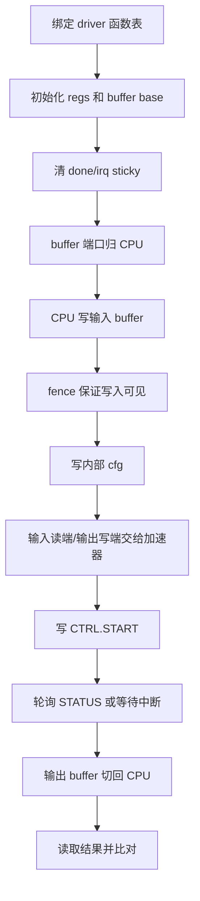

# 阶段二：如何修改 software 文件夹，让 CPU 通过 MMIO 控制自定义硬件

本文是“往 CPU 的 AXI 总线上加自定义模块”系列教程的第 2 篇。

它从当前最新 `minimum_my_mxu_axu` 版本出发，总结 software 目录中应该如何为任意 AXI/MMIO 自定义外设编写地址契约、驱动、测试 app 和构建入口。

MXU 和 AXU 只是本文的两个例子。真正需要掌握的是：硬件 wrapper 暴露了一组 MMIO 地址后，软件如何准确镜像这组地址、寄存器、bit、buffer 布局和中断编号，并把这些契约落到 driver、app、`app.mk` 和仿真运行配置中。

当前 MXU/AXU 软件主要是 baremetal 直接 MMIO 访问。本文不讨论 Linux kernel driver、设备树节点、`/dev/mem` 或 userspace `mmap` 方案。

## 0. 软件阶段要解决什么问题

硬件阶段完成后，CPU 看到的是若干固定物理地址窗口。例如当前 `minimum_my_mxu_axu` 中：

| 模块 | cfg | input0 | input1 | output |
|---|---:|---:|---:|---:|
| MXU | `0x7000_0000` | `0x7000_8000` | `0x7001_0000` | `0x7001_8000` |
| AXU | `0x7002_0000` | `0x7002_8000` | `0x7003_0000` | `0x7003_8000` |

software 阶段要完成的是：

1. 在 `software/soc/include/*.h` 中定义硬件/软件共同契约。
2. 在 `software/soc/src/*.c` 中实现 MMIO driver API。
3. 在 `software/app/*/main.c` 中实现最小可验证的 SoC 测试流程。
4. 在 `software/app/*/app.mk` 中接入构建系统和数据生成脚本。
5. 在运行脚本或仿真命令中确认 app ELF 与 SoC filelist 匹配。
6. 让 CPU 完成：写输入 buffer、写配置、切换 buffer ownership、start、wait done、读输出、比对结果。

软件不能自己发明地址。所有 base、offset、bit、cfg 编号和 buffer 公式都必须来自硬件 wrapper 与 SoC address map。

## 1. 总体流程、文件地图与实施顺序

本节先给出完整路线图。读者在进入具体文件前，应该先知道 CPU 控制 AXI/MMIO 加速器的通用流程、software 目录中会改哪些文件，以及新增一个模块时推荐按什么顺序推进。

### 1.1 CPU 控制 AXI/MMIO 加速器的通用流程

对 AXI/MMIO wrapper 型加速器，推荐软件流程如下：



这个流程对 MXU、AXU 都适用。不同模块的差别主要体现在：buffer 名字、内部 cfg 编号、测试数据布局、特殊状态机和构建变量。

### 1.2 software 目录中需要新增或修改的文件

当前 MXU/AXU 相关软件文件如下：

| 文件 | 作用 |
|---|---|
| `software/soc/include/my_mxu.h` | MXU base、size、register offset、bit、cfg 编号、buffer offset、IRQn、driver struct |
| `software/soc/src/my_mxu.c` | MXU driver 实现 |
| `software/app/my_mxu_test/main.c` | MXU baremetal 测试 app |
| `software/app/my_mxu_test/app.mk` | MXU app 构建入口，调用 `gen_input_data.py` |
| `software/soc/include/my_axu.h` | AXU base、size、register offset、bit、cfg 编号、unit/function 编码、buffer offset、IRQn、driver struct |
| `software/soc/src/my_axu.c` | AXU driver 实现 |
| `software/app/my_axu_test/main.c` | AXU baremetal 测试 app |
| `software/app/my_axu_test/app.mk` | AXU app 构建入口，调用 `gen_input_data_axu.py` |
| `software/soc/include/global_buffer.h` | GlobalBuffer 软件地址定义 |
| `software/app/mxu_idma_gbuf_test/main.c` | iDMA 在 GlobalBuffer 和 MXU WGT buffer 之间搬运的集成测试 |
| `software/soc/include/dcim.h` | DCIM base、region、cfg/ctrl slot、mode/topo、buffer 公式、`struct dcim_drv` |
| `software/soc/src/dcim.c` | DCIM driver 实现 |
| `software/app/dcim_test/main.c` | DCIM baremetal smoke / kick 流程测试 |
| `software/app/dcim_test/app.mk` | DCIM app 构建入口（`DCIM_TEST_TOPO`、`DCIM_WAIT_CYCLES`） |

新增模块时，建议按同样结构增加：

```text
software/soc/include/my_accel.h
software/soc/src/my_accel.c
software/app/my_accel_test/main.c
software/app/my_accel_test/app.mk
```

### 1.3 新增任意模块的软件实施顺序

假设新增 `my_accel`，推荐按下面顺序推进：

1. 从硬件文档拿到地址窗口、寄存器 offset、bit、buffer 布局、IRQ source。
2. 写 `software/soc/include/my_accel.h`：只做硬件/软件契约定义，不写复杂逻辑。
3. 写 `software/soc/src/my_accel.c`：封装 `init`、`write_cfg`、`set_ports`、`start`、`read_status`、`wait_done`、`clear_done`。
4. 写最小 app：只读 `STATUS`，确认 CPU 访问地址通。
5. 扩展 app：写一个 cfg/control 寄存器，读回或观察状态变化。
6. 再加入 buffer 写入、cfg、start、done、output 比对。
7. 在 `app.mk` 中加入 driver 源文件、include path、构建变量和数据生成脚本。
8. 在运行脚本或仿真命令中确认 app ELF 与 SoC filelist 匹配。
9. 最后接入完整测试数据和回归脚本。

不要一开始就写完整模型和复杂 golden compare。先让 CPU 访问地址通，再让控制通，再让数据通。

### 1.4 本文后续章节如何展开

后续章节会按这个实施顺序展开：先讲 include 头文件中的硬件/软件契约，再讲 buffer 地址公式、driver API、app 最小验证流程、IRQ/fence/volatile 约束、`app.mk` 与 filelist 配置，最后给出 checklist 和常见错误排查。

## 2. 第一步：在 include 头文件中定义硬件/软件共同契约

第一步要改的是 `software/soc/include/my_*.h`。头文件的任务是把硬件 wrapper 暴露的 MMIO 契约翻译成 C 宏、C struct 和 driver 类型声明。

### 2.1 base address 和窗口大小

当前 MXU 软件宏：

| 宏 | base | size | 用途 |
|---|---:|---:|---|
| `MY_MXU_CFG_BASE` | `0x70000000` | `0x1000` | cfg/register 窗口 |
| `MY_MXU_WGT_BASE` | `0x70008000` | `0x8000` | weight buffer |
| `MY_MXU_ACT_BASE` | `0x70010000` | `0x8000` | activation buffer |
| `MY_MXU_OUT_BASE` | `0x70018000` | `0x8000` | output buffer |

当前 AXU 软件宏：

| 宏 | base | size | 用途 |
|---|---:|---:|---|
| `MY_AXU_CFG_BASE` | `0x70020000` | `0x1000` | cfg/register 窗口 |
| `MY_AXU_OPA_BASE` | `0x70028000` | `0x8000` | operand A buffer |
| `MY_AXU_OPB_BASE` | `0x70030000` | `0x8000` | operand B buffer |
| `MY_AXU_OUT_BASE` | `0x70038000` | `0x8000` | output buffer |

这些宏必须与 `hardware/soc/minimum_my_mxu_axu/ariane_soc_pkg.sv` 中的 base/length 一致。

### 2.2 register offset 和 64-bit MMIO struct

MXU/AXU wrapper 采用相同的 64-bit MMIO 槽位布局：

| offset | 通用含义 | MXU 名称 | AXU 名称 |
|---:|---|---|---|
| `0x000` | 控制寄存器 | `CTRL` | `CTRL` |
| `0x008` | 状态寄存器 | `STATUS` | `STATUS` |
| `0x010` | input0 buffer control | `WGT_BUF_CTRL` | `OPA_BUF_CTRL` |
| `0x018` | input1 buffer control | `ACT_BUF_CTRL` | `OPB_BUF_CTRL` |
| `0x020` | output buffer control | `OUT_BUF_CTRL` | `OUT_BUF_CTRL` |
| `0x028` | 保留 | `_reserved0` | `_reserved0` |
| `0x030` | 内部 cfg 写入口 | `CFG_WRITE` | `CFG_WRITE` |
| `0x038` | IRQ mask | `IRQ_MASK` | `IRQ_MASK` |
| `0x040` | IRQ status | `IRQ_STAT` | `IRQ_STAT` |

软件 struct 使用 `volatile uint64_t`，原因是：

1. 每个寄存器槽位是 64-bit 对齐的。
2. MMIO 读写有副作用，不能被编译器优化掉。
3. 每次读取 status 都必须真实访问硬件。
4. 每次写 `CFG_WRITE` 都会触发 wrapper 内部配置动作。

不要把寄存器 struct 改成 32-bit，也不要删除 `0x028` 的 reserved 槽位。

### 2.3 通用 bit 定义

| 寄存器 | bit | 含义 |
|---|---:|---|
| `CTRL` | 0 | `START`，写 1 触发一次启动 pulse |
| `CTRL` | 1 | `CLR_DONE`，清 done sticky 和 irq sticky |
| `STATUS` | 0 | `BUSY` |
| `STATUS` | 1 | `DONE` |
| buffer control | 0 | 读端口交给加速器 |
| buffer control | 1 | 写端口交给加速器 |
| `CFG_WRITE` | `[3:0]` | 内部 cfg address |
| `CFG_WRITE` | `[15:8]` | 内部 cfg data |

AXU 额外有：

| 寄存器 | bit | 含义 |
|---|---:|---|
| `STATUS` | 2 | `CALC_DONE`，AXU 特有，表示一次计算完成，不一定等价于整个 case 流程完成 |

## 3. 第二步：定义 buffer 地址公式和数据布局

第二步仍然发生在 `software/soc/include/my_*.h` 中，但关注点从寄存器切换到 buffer 地址公式。

MXU/AXU 的三个 buffer 当前都是：

```text
8 bank * 256 row * 128 bit = 32768 byte = 0x8000
```

软件按两个 64-bit half word 访问每个 bank-row：

```text
offset = (bank[2:0] << 12) | (row[7:0] << 4) | (half64[0] << 3)
```

也就是：

| 维度 | 间隔 |
|---|---:|
| bank | `0x1000` |
| row | `0x10` |
| half64 | `0x8` |

MXU 使用 `mxu_buf_word_offset(bank, row, half64)`，AXU 使用 `axu_buf_word_offset(bank, row, half64)`。公式相同，但前缀分开，避免不同模块的语义混用。

新增模块时必须同时确认：

1. 硬件 buffer 的 bank 数、row 数、row 宽度。
2. 软件 offset 公式是否覆盖完整 buffer 空间。
3. `*_SIZE` 宏是否等于硬件窗口大小。
4. 数据生成脚本是否按同一个 bank/row/half64 规则打包。

## 4. 第三步：在 src 中实现 MMIO driver API

第三步要改的是 `software/soc/src/my_*.c`。driver 的目标不是写业务测试，而是把裸 MMIO 操作封装成稳定 API，让 app 按固定顺序调用。

### 4.1 MXU driver 示例

MXU 驱动围绕 `struct my_mxu_drv` 展开，核心成员包括：

- `regs`：指向 `MY_MXU_CFG_BASE`。
- `wgtbuf`：指向 `MY_MXU_WGT_BASE`。
- `actbuf`：指向 `MY_MXU_ACT_BASE`。
- `outbuf`：指向 `MY_MXU_OUT_BASE`。

MXU driver 需要封装：

- `init`
- `mxu_write_cfg`
- `mxu_config_common`
- `mxu_set_wgt_ports`
- `mxu_set_act_ports`
- `mxu_set_out_ports`
- `mxu_start`
- `mxu_read_status`
- `mxu_wait_done`
- `mxu_clear_done`

MXU 内部 cfg 编号包括：

| cfg addr | 含义 |
|---:|---|
| 0-3 | weight tile base |
| 4-7 | activation tile base |
| 8-11 | output tile base |
| 12 | activation batch size |
| 13 | systolic array dataflow mode：`FF=0`，`BP=1` |
| 14 | data type mode：`POSIT=0`，`INT=1` |

### 4.2 AXU driver 示例

AXU 驱动结构与 MXU 类似，但 buffer 和 cfg 语义不同：

- `regs`：指向 `MY_AXU_CFG_BASE`。
- `opabuf`：指向 `MY_AXU_OPA_BASE`。
- `opbbuf`：指向 `MY_AXU_OPB_BASE`。
- `outbuf`：指向 `MY_AXU_OUT_BASE`。

AXU driver 需要封装：

- `init`
- `axu_write_cfg`
- `axu_set_unit`
- `axu_set_func`
- `axu_set_batch_size`
- `axu_set_op_a_base`
- `axu_set_op_b_base`
- `axu_set_vec_out_base`
- `axu_set_reduce_out_base`
- `axu_set_seed_high_base`
- `axu_set_seed_low_base`
- `axu_load_seed`
- `axu_set_opa_ports`
- `axu_set_opb_ports`
- `axu_set_out_ports`
- `axu_start`
- `axu_read_status`
- `axu_wait_done`
- `axu_clear_done`

AXU 内部 cfg 编号包括：

| cfg addr | 含义 |
|---:|---|
| 0 | function select |
| 1 | op_a base row |
| 2 | op_b base row |
| 3 | vector output base row |
| 4 | reduce output base row |
| 5 | batch size |
| 6 | unit select |
| 7 | SFU seed high base row |
| 8 | SFU seed low base row |
| 9 | SFU seed load trigger |

AXU unit/function 编码：

| unit | 编码 | 典型 function |
|---|---:|---|
| VPU | 0 | add、sub、mul、max、min、reduce_max、reduce_sum |
| SFU | 1 | cordic、rng、int2posit |
| NLI | 2 | load_mult_lut、load_y_bound_lut、compute |
| Scheduler | 3 | run |

### 4.3 新模块 driver 最小 API 模板

新增 `my_accel` 时，不建议 app 直接散落裸指针访问。至少先提供这些 API：

```text
init(regs, input buffers, output buffer)
write_cfg(cfg_addr, cfg_data)
set_input_ports(rd_to_acc, wr_to_acc)
set_output_ports(rd_to_acc, wr_to_acc)
start()
read_status()
wait_done(timeout)
clear_done()
```

这样 app 可以专注测试流程，而不是到处重复 MMIO 位操作。

## 5. 第四步：在 app 中实现最小可验证测试流程

第四步要改的是 `software/app/my_*_test/main.c`。app 的目标是证明 CPU 能按正确顺序控制硬件，而不是把所有 corner case 一次性塞进去。

### 5.1 推荐从最小 app 开始

新增模块时，app 应该分层推进：

1. 只读 `STATUS`，确认地址通。
2. 写 `CTRL.CLR_DONE` 或一个 cfg/control 寄存器，确认控制通。
3. 写一小段 input buffer，确认 buffer 地址公式通。
4. 写最小 cfg，切 buffer ownership，写 `CTRL.START`。
5. 轮询 `STATUS.BUSY/DONE` 或等待中断。
6. 输出切回 CPU，读 output buffer。
7. 先和 app 内部写死 expected 比对，再接入完整 `input_data.h` 和 golden。

### 5.2 MXU app 流程

MXU 测试 app 的典型流程：

1. `my_mxu_bind(&my_mxu0)`。
2. `my_mxu0.init(...)`。
3. `mxu_set_wgt_ports/act_ports/out_ports(..., 0, 0)`，让 CPU 拥有 buffer。
4. CPU 写 `MXU_WGT_DATA` 和 `MXU_ACT_DATA`。
5. 执行 `fence`。
6. 写 cfg：weight tile base、activation tile base、output tile base、batch、flow mode、data type mode。
7. 切端口：wgt/act 读端给 MXU，out 写端给 MXU。
8. `mxu_start()`。
9. `mxu_wait_done()`。
10. 输出切回 CPU，读取 output buffer 并比对 golden。

MXU app 的构建变量是 `MXU_TEST_MODE`，当前默认值为 `posit_bp`，支持 `int_ff`、`posit_ff`、`posit_bp`。

### 5.3 AXU app 流程

AXU app 的整体流程与 MXU 类似，但 case 更多、特殊流程更多。

常用 case 包括：

```text
vpu_add
vpu_sub
vpu_mul
vpu_max
vpu_min
vpu_reduce_max
vpu_reduce_sum
sfu_int2posit
sfu_rng
nli_mish
nli_tanh
scheduler
```

AXU 有几个容易忽略的特殊点：

1. `sfu_rng` 需要先执行 seed load，再执行 rng 计算。
2. `nli_mish` 和 `nli_tanh` 需要先加载 LUT，再执行 compute。
3. reduce 和 scheduler 类 case 通常只比较部分 bank，例如 bank0。
4. `STATUS[2] = CALC_DONE` 是 AXU 特有状态，不能简单替代 `STATUS[1] = DONE`。

AXU app 的构建变量是 `AXU_TEST_CASE`。如果指定单 case，`app.mk` 会增加 `-DAXU_TEST_CASE_<case>`。

## 6. 第五步：处理中断编号、fence 和访问顺序约束

第五步不是新增某一个文件，而是确认 CPU 与硬件交互的运行时约束。这一步会影响 driver 和 app 的可靠性。

### 6.1 中断编号的软件镜像

硬件中断从 `ariane_peripherals.sv` 的 `irq_sources[]` 进入 PLIC。软件侧当前使用 `IRQn = irq_sources index + 1`。

| 模块 | 硬件连接 | 软件 IRQn |
|---|---:|---:|
| AXU | `irq_sources[1]` | 2 |
| MXU | `irq_sources[2]` | 3 |
| iDMA desc64 | `irq_sources[7]` | 8 |

当前 MXU/AXU 普通测试主要使用轮询；`mxu_idma_gbuf_test` 使用 DMA 中断。即使暂时不用中断，也应该在头文件里写清楚 IRQ 编号，避免后续接入 PLIC 时混乱。

### 6.2 volatile、fence 和访问顺序

CPU 对 MMIO 和 buffer 的访问顺序不能完全依赖普通 C 语义。建议遵守：

1. MMIO 寄存器 struct 使用 `volatile`。
2. 写完输入 buffer 后，在切 ownership 或 start 前执行 fence。
3. 写 cfg 后，再切 buffer ownership。
4. 切 ownership 后，再写 `CTRL.START`。
5. 等 done 后，先把 output buffer 切回 CPU，再读结果。

如果缺少 fence 或顺序错误，常见现象是：仿真偶发失败、done 了但输出仍是旧值、部分 bank 不稳定。

## 7. 第六步：在 app.mk 和运行脚本中接入构建变量、数据生成与 SoC filelist

第六步同时处理构建入口和运行入口。`app.mk` 决定软件怎么编译，运行脚本或仿真命令决定这个软件跑在哪个 SoC filelist 上。这两件事必须放在一起检查。

### 7.1 在 app.mk 中接入 driver 和数据生成

`app.mk` 至少要完成这些工作：

1. 把 app 的 `main.c` 加入源码列表。
2. 把对应 driver 源文件加入源码列表，例如 `my_mxu.c` 或 `my_axu.c`。
3. 如果需要测试数据，调用 Python 脚本生成 `input_data.h`。
4. 把生成目录加入 include path。
5. 定义构建变量，例如 `MXU_TEST_MODE` 或 `AXU_TEST_CASE`。
6. 对 AXU 这类单 case 编译的 app，生成 `-DAXU_TEST_CASE_<case>`。

典型构建命令：

```bash
make my_mxu_test MXU_TEST_MODE=posit_bp
make my_axu_test AXU_TEST_CASE=vpu_add
make mxu_idma_gbuf_test
```

### 7.2 确认 app ELF 与 SoC filelist 匹配

软件 app 本身不决定 SoC 里有哪些外设。运行仿真时，app 和 filelist 必须匹配：

| app | 推荐 SoC/filelist |
|---|---|
| `my_mxu_test` | `filelist_minimum_my_mxu_axu.f` 或明确仍在使用旧 `minimum_my_mxu` 时用旧 filelist |
| `my_axu_test` | `filelist_minimum_my_mxu_axu.f` |
| `mxu_idma_gbuf_test` | `filelist_minimum_my_mxu_axu.f` |
| `dcim_test` | **`filelist_minimum_dcim.f`** |

如果 AXU app 用了只包含 MXU 的旧 filelist，CPU 访问 `0x7002_0000` 之后的 AXU 地址不会得到正确外设响应。

经验规则：

- app ELF 决定 CPU 执行什么程序。
- SoC filelist 决定仿真里实例化了哪些硬件。
- 软件地址宏再正确，如果 filelist 不包含对应硬件，访问仍然不会成功。

## 8. 第七步：按照 software checklist 复查

完成 include、driver、app、构建和 filelist 后，按下面 checklist 复查：

- [ ] 头文件 base address 与 `ariane_soc_pkg.sv` 一致。
- [ ] register offset 与 wrapper localparam 一致。
- [ ] struct 使用 `volatile uint64_t` 并保留 reserved 槽位。
- [ ] `CFG_WRITE` 的 address/data 位宽与 wrapper 一致。
- [ ] buffer offset 公式与硬件 bank/row/word 布局一致。
- [ ] ownership bit 含义与 wrapper 一致。
- [ ] IRQn 与 `irq_sources index + 1` 一致。
- [ ] driver 中 init、write_cfg、set_ports、start、wait、clear done API 清晰。
- [ ] app 从最小验证开始，不直接跳到复杂 golden compare。
- [ ] app 中写 buffer、fence、写 cfg、切 ownership、start、wait done、读 output 的顺序正确。
- [ ] `app.mk` 把 driver 源文件加入编译。
- [ ] 数据生成目录已经加入 include path。
- [ ] app 与仿真 filelist 使用同一个 SoC 变体。

## 9. 常见错误

### 9.1 头文件契约错误：status 永远读 0

检查 base address、filelist、`addr_map`、`ariane_peripherals` 连接、寄存器 offset。

### 9.2 driver/start 流程错误：start 后 timeout

检查 `CTRL.START` offset、cfg 是否写入、输入读端是否切给加速器、输出写端是否切给加速器、核心 done 是否接回 wrapper。

### 9.3 buffer ownership 或 fence 错误：输出全 0 或 poison 值

检查输出 buffer 的写端是否在运行时给了加速器，done 后读端是否切回 CPU，以及输出 base row 是否和 compare 读取 row 一致。

### 9.4 AXU case 宏错误：编译或运行 case 不对

检查 `AXU_TEST_CASE` 是否传入、`-DAXU_TEST_CASE_<case>` 是否生效、case 名是否在脚本支持列表中。

### 9.5 IRQ 编号错误：中断收不到或收错源

检查硬件 `irq_sources[i]` 和软件 `IRQn = i + 1` 的转换关系。不要把 `irq_sources[1]` 误写成软件 IRQn 1。

### 9.6 app 与 filelist 不匹配：软件地址正确但硬件不存在

检查运行脚本中的 `FILELIST` 是否包含当前 app 访问的外设。AXU app 必须使用包含 AXU 的 SoC 变体。

## 11. DCIM wrap 软件设置（`minimum_dcim`）

DCIM 与 MXU/AXU 不同：SoC 只暴露 **一个** AXI 从窗口 `@ 0xE000_0000`，`adapt_decode` 在窗口内用 `axi_addr[19:17]` 再分出 ctrl/cfg/act/out/wei。软件仍按 doc 同一套流程落地，但头文件要描述 **region** 而不是多个 xbar enum。

### 11.1 地址与 filelist 契约

| 宏 | base | size | 用途 |
|---|---:|---:|---|
| `DCIM_CTRL_BASE` | `0xE000_0000` | region `0x20000` | START / CLR / LOAD / SWAP |
| `DCIM_CFG_BASE` | `0xE002_0000` | region `0x20000` | cfg 槽位（64-bit MMIO struct） |
| `DCIM_ACT_BASE` | `0xE004_0000` | bank `0x800` × 4 | activation buffer |
| `DCIM_OUT_BASE` | `0xE006_0000` | bank `0x2000` × 4 | output buffer |
| `DCIM_WEI_BASE` | `0xE008_0000` | bank `0x8000` × 4 | weight buffer |

SoC 总窗口 `DCIM_LENGTH = 0xA0000`，必须与 `hardware/soc/minimum_dcim/ariane_soc_pkg.sv` 一致。

| app | 必须使用的仿真 filelist |
|---|---|
| `dcim_test` | `sim/filelist_minimum_dcim.f` |

一键脚本：`./dcim_shell.sh`（默认 `DCIM_TEST_TOPO=3` 单路 topo）。

### 11.2 cfg / ownership / ctrl

| cfg slot `[6:3]<<3` | 含义 |
|---:|---|
| `0x00` | `cfg_ena` |
| `0x08` | `cfg_topo`（0=4 路，2=2 路，3=1 路） |
| `0x10` | `cfg_mode`（见 `dcim.h` 中 `DCIM_MODE_*`） |
| `0x18` | `cfg_acc` |
| `0x28` / `0x30` | `act_length` / `out_length` |
| `0x38`–`0x48` | `act_sel` / `out_sel` / `wei_sel`（1=CPU，0=加速器） |

`CTRL.START` 写后硬件会自动把三个 `*_sel` 切到加速器；done 后软件需再写回 CPU 才能读 output。

当前 RTL **无 MMIO STATUS、无 PLIC 中断**：driver 的 `wait_done()` 为软件延时环；可通过 `make dcim_test DCIM_WAIT_CYCLES=…` 调整。

### 11.3 推荐软件流程（`dcim_test`）

1. `dcim_bind(&dcim0)` → `init(cfg, act, out, wei)`。
2. `set_buffer_owner(CPU, CPU, CPU)` → 写 act/wei（及后续 out golden）。
3. **`DCIM_FENCE_OW`**（写穿 D-cache，同 VMMA/MXU）。
4. `configure(topo, mode, acc, act_len, out_len, loop)`。
5. `start()` → `wait_done(timeout)`。
6. `set_buffer_owner(CPU, CPU, CPU)` → **`DCIM_FENCE_RW`** → 读 out 比对。
7. UART 打印 **`DCIM_PASS`** / **`DCIM_FAIL`**。

### 11.4 app.mk 构建变量

```makefile
# software/app/dcim_test/app.mk
DCIM_TEST_TOPO ?= 3          # 传给 -DDCIM_TEST_TOPO
# make dcim_test DCIM_WAIT_CYCLES=10000000
```

driver 源文件必须编入 app：`$(SOC_DIR)/src/dcim.c`。

## 12. 本阶段结论

software 阶段的核心是把硬件 wrapper 暴露出的 MMIO 契约精确翻译成 C 头文件、driver API、test app 和构建/运行配置。MXU、AXU 的驱动形态不同，但基本模式一致：

```text
base/offset/bit 定义 -> volatile regs -> driver API -> test app -> app.mk -> SoC filelist -> 仿真脚本
```

只要硬件和软件共享同一份地址、寄存器、buffer、IRQ 和 filelist 语义，后续新增任意 AXI/MMIO 自定义模块都可以按同样方法落地。
