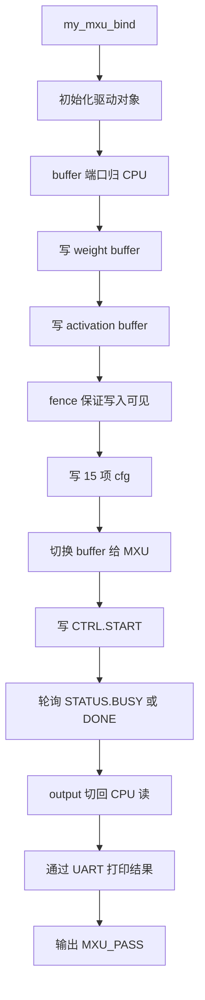

# 阶段二：如何修改 software 文件夹，让 CPU 通过 MMIO 控制 MXU

本文是“往 CPU 的 AXI 总线上加自定义模块”系列教程的第 2 篇，目标是解释已经跑通的 `my_mxu` 版本中，software 目录到底改了什么、为什么这样改、初学者如何按步骤复现。

当前教程以 `work_for_tapeout_2026/Soc_w_ASIC-main` 中已经验证通过的版本为事实基准。该版本已经完成：

- `int_ff` 通过。
- `posit_ff` 通过。
- `posit_bp` 通过。
- 三个模式的 `compare_report.txt` 均显示 `result: PASS`。

读本文前，应该先理解硬件教程：

`如何修改hardware文件夹下的内容？.md`

因为软件不能自己发明地址、寄存器和 bit 定义。软件里的所有 base address、register offset、buffer 地址公式，都必须和硬件 wrapper、SoC address map 保持一致。

## 0. software 阶段最终要完成什么

hardware 阶段完成后，CPU 能通过 AXI 访问 4 个 MXU 地址窗口：

| 软件宏 | base | 用途 |
|---|---:|---|
| `MY_MXU_CFG_BASE` | `0x70000000` | 控制寄存器窗口 |
| `MY_MXU_WGT_BASE` | `0x70008000` | weight buffer |
| `MY_MXU_ACT_BASE` | `0x70010000` | activation buffer |
| `MY_MXU_OUT_BASE` | `0x70018000` | output buffer |

software 阶段要做的是：

1. 在 `software/soc/include/my_mxu.h` 中定义硬件/软件共同契约。
2. 在 `software/soc/src/my_mxu.c` 中实现 MMIO 驱动。
3. 在 `software/app/my_mxu_test/main.c` 中实现 SoC 上的 MXU 测试流程。
4. 在 `software/app/my_mxu_test/app.mk` 中接入构建系统，并调用脚本生成 `input_data.h`。
5. 让 CPU 完成：写输入 buffer → 写配置 → 切换端口归属 → start → wait done → 读输出 → 打印 marker。

## 1. 软件控制 MXU 的完整流程

SoC 软件复刻了原始 MXU 单模块 testbench 的关键顺序，只是把“testbench 直接写信号”改成了“CPU 通过 MMIO 写寄存器和 buffer”。



当前 `my_mxu_test/main.c` 的核心顺序是：

1. 打印 `MXU_SOC_TEST_BEGIN` 和 `MXU_MODE ...`。
2. `my_mxu_bind(&my_mxu0)`。
3. `my_mxu0.init(...)`。
4. 设置 `wgt/act/out` 端口都归 CPU。
5. 写入 `MXU_WGT_DATA` 和 `MXU_ACT_DATA`。
6. 执行 `fence`。
7. 写 cfg table。
8. 设置 `wgt`、`act` 读端给 MXU，`out` 写端给 MXU。
9. 写 `CTRL.START`。
10. 轮询等待完成。
11. 把 `wgt/act/out` 切回 CPU。
12. 输出 `MXU_PASS` 和 `MXU_SOC_TEST_END`。

注意：当前本地可见的 `main.c` 中，`dump_output_bank_files_compatible()` 和 `compare_output()` 代码存在，但调用处是注释状态。若只是观察 `MXU_PASS`，可以不打开 dump；但如果要重新生成 `output.txt` 并让 `log2txt_mxu.py` / `compare_mxu.py` 完整跑通，UART log 中必须包含 `===MXU_OUT_BANK_BEGIN ...===` 到 `===MXU_OUT_BANK_END ...===` 的输出。因此重新跑一键 compare 前，要确认运行的 `my_mxu_test` 版本会打印完整 MXU_OUT dump。

## 2. 当前跑通版本的软件文件地图

一、驱动头文件：

`Soc_w_ASIC-main/software/soc/include/my_mxu.h`

作用：

- 定义 MXU 四个 base address。
- 定义 cfg 寄存器 offset。
- 定义 CTRL/STATUS/BUF_CTL/IRQ bit mask。
- 定义 cfg address 编号。
- 定义 buffer 参数和地址计算公式。
- 定义驱动结构体 `struct my_mxu_drv`。
- 声明 `my_mxu_bind()`。

二、驱动实现：

`Soc_w_ASIC-main/software/soc/src/my_mxu.c`

作用：

- 实现 init。
- 实现 cfg 写入。
- 实现 buffer ownership 切换。
- 实现 start。
- 实现 status 读取。
- 实现 wait done。
- 实现 clear done。
- 绑定函数指针到 `struct my_mxu_drv`。

三、测试 app：

`Soc_w_ASIC-main/software/app/my_mxu_test/main.c`

作用：

- include `my_mxu.h`。
- include 自动生成的 `input_data.h`。
- 把脚本生成的数据写入 MXU buffer。
- 按 mode 写配置。
- 启动 MXU。
- 等待完成。
- 打印 UART marker。

四、app 构建描述：

`Soc_w_ASIC-main/software/app/my_mxu_test/app.mk`

作用：

- 定义 `MXU_TEST_MODE`。
- 调用 `zzc_workspace_mxu/file_format_transform/gen_input_data.py` 生成 `input_data.h`。
- 给 `main.c` 增加 generated include path。
- 把 `software/soc/src/my_mxu.c` 加入编译。

五、生成文件：

`software/build/app/my_mxu_test/gen/input_data.h`

作用：

- 由 `gen_input_data.py` 自动生成。
- 不应该手写。
- 包含当前测试模式的 weight、activation、golden、cfg 参数。

## 3. 硬件/软件共同契约

软件最重要的原则：与硬件保持一致。

### 3.1 地址窗口契约

当前跑通版本在 `my_mxu.h` 中定义：

- `MY_MXU_CFG_BASE = 0x70000000UL`
- `MY_MXU_WGT_BASE = 0x70008000UL`
- `MY_MXU_ACT_BASE = 0x70010000UL`
- `MY_MXU_OUT_BASE = 0x70018000UL`

窗口大小：

- `MY_MXU_CFG_SIZE = 0x1000UL`
- `MY_MXU_WGT_SIZE = 0x8000UL`
- `MY_MXU_ACT_SIZE = 0x8000UL`
- `MY_MXU_OUT_SIZE = 0x8000UL`

这些值必须与：

- `hardware/soc/minimum_my_mxu/ariane_soc_pkg.sv`
- `hardware/soc/minimum_my_mxu/ariane_soc_top.sv`

完全一致。

### 3.2 寄存器 offset 契约

当前 `my_mxu.h` 中定义：

| 宏 | offset | 对应 wrapper 寄存器 |
|---|---:|---|
| `MY_MXU_REG_CTRL_OFF` | `0x000` | `CTRL` |
| `MY_MXU_REG_STATUS_OFF` | `0x008` | `STATUS` |
| `MY_MXU_REG_WGT_BUF_CTRL_OFF` | `0x010` | `WGT_BUF_CTL` |
| `MY_MXU_REG_ACT_BUF_CTRL_OFF` | `0x018` | `ACT_BUF_CTL` |
| `MY_MXU_REG_OUT_BUF_CTRL_OFF` | `0x020` | `OUT_BUF_CTL` |
| `MY_MXU_REG_CFG_WRITE_OFF` | `0x030` | `CFG_WRITE` |
| `MY_MXU_REG_IRQ_MASK_OFF` | `0x038` | `IRQ_MASK` |
| `MY_MXU_REG_IRQ_STAT_OFF` | `0x040` | `IRQ_STAT` |

这些 offset 必须与 `hardware/user_ip/my_mxu/mxu_top_wrapper.sv` 中的 `REG_*` localparam 完全一致。

### 3.3 bit mask 契约

当前约定：

- `MY_MXU_CTRL_START = bit0`
- `MY_MXU_CTRL_CLR_DONE = bit1`
- `MY_MXU_STATUS_BUSY = bit0`
- `MY_MXU_STATUS_DONE = bit1`
- `MY_MXU_BUF_RD_MXU = bit0`
- `MY_MXU_BUF_WR_MXU = bit1`

含义：

- `CTRL.START`：启动 MXU，wrapper 产生 `start_i` 单周期脉冲。
- `CTRL.CLR_DONE`：清除 done sticky 和 irq sticky。
- `STATUS.BUSY`：MXU 正在计算。
- `STATUS.DONE`：MXU 完成，wrapper 保存 sticky done。
- `BUF_RD_MXU`：buffer 读端交给 MXU。
- `BUF_WR_MXU`：buffer 写端交给 MXU。

## 4. my_mxu.h 详解

路径：

`Soc_w_ASIC-main/software/soc/include/my_mxu.h`

### 4.1 base address 宏

这些宏让软件能访问硬件窗口：

- `MY_MXU_CFG_BASE`
- `MY_MXU_WGT_BASE`
- `MY_MXU_ACT_BASE`
- `MY_MXU_OUT_BASE`
- `MY_MXU_WGTBUF_BASE`
- `MY_MXU_ACTBUF_BASE`
- `MY_MXU_OUTBUF_BASE`

`MY_MXU_WGTBUF_BASE` 等是别名，便于驱动和 app 更直观地表示 buffer。

### 4.2 cfg address 编号

MXU 内部 cfg 共 15 项，当前软件定义如下：

| cfg 编号 | 宏 | 含义 |
|---:|---|---|
| 0 | `MXU_CFG_WGT_TILE0_BASE_ADDR` | weight tile0 base |
| 1 | `MXU_CFG_WGT_TILE1_BASE_ADDR` | weight tile1 base |
| 2 | `MXU_CFG_WGT_TILE2_BASE_ADDR` | weight tile2 base |
| 3 | `MXU_CFG_WGT_TILE3_BASE_ADDR` | weight tile3 base |
| 4 | `MXU_CFG_ACT_TILE0_BASE_ADDR` | activation tile0 base |
| 5 | `MXU_CFG_ACT_TILE1_BASE_ADDR` | activation tile1 base |
| 6 | `MXU_CFG_ACT_TILE2_BASE_ADDR` | activation tile2 base |
| 7 | `MXU_CFG_ACT_TILE3_BASE_ADDR` | activation tile3 base |
| 8 | `MXU_CFG_OUT_TILE0_BASE_ADDR` | output tile0 base |
| 9 | `MXU_CFG_OUT_TILE1_BASE_ADDR` | output tile1 base |
| 10 | `MXU_CFG_OUT_TILE2_BASE_ADDR` | output tile2 base |
| 11 | `MXU_CFG_OUT_TILE3_BASE_ADDR` | output tile3 base |
| 12 | `MXU_CFG_ACT_BATCHSIZE_M` | batch size M |
| 13 | `MXU_CFG_SA_DATA_FLOW_MODE` | FF/BP 模式 |
| 14 | `MXU_CFG_SA_DATA_TYPE_MODE` | posit/int 模式 |

模式编码：

- `MXU_FLOW_FF = 0`
- `MXU_FLOW_BP = 1`
- `MXU_TYPE_POSIT = 0`
- `MXU_TYPE_INT = 1`

对应三种测试：

| 模式 | flow | type |
|---|---:|---:|
| `int_ff` | 0 | 1 |
| `posit_ff` | 0 | 0 |
| `posit_bp` | 1 | 0 |

### 4.3 buffer 地址计算公式

当前 `my_mxu.h` 中定义：

```c
#define mxu_buf_word_offset(bank, row, half64) \
    ((((uint32_t)(bank) & 0x7u) << 12) | \
     (((uint32_t)(row) & 0xFFu) << 4) | \
     (((uint32_t)(half64) & 0x1u) << 3))
```

含义：

- `bank`：0 到 7，共 8 个 bank。
- `row`：0 到 255，共 256 行。
- `half64`：0 或 1。
- 一个 row 是 128 bit，即 16 字节。
- CPU 每次访问 64 bit，即 8 字节。
- `half64=0` 表示低 64 bit。
- `half64=1` 表示高 64 bit。

地址展开：

- bank 选择放在 bit `[14:12]`。
- row 选择放在 bit `[11:4]`。
- half64 选择放在 bit `[3]`。

这和窗口大小 `0x8000` 匹配：

- 每个 bank：256 row × 16 byte = 4096 byte = `0x1000`。
- 8 个 bank：8 × `0x1000` = `0x8000`。

### 4.4 volatile 的必要性

`struct my_mxu_regs` 中每个寄存器都是：

- `volatile uint64_t`

原因：

- MMIO 不是普通内存。
- 编译器不能优化掉读写。
- 每次读 `status` 都必须真的发起总线访问。
- 每次写 `cfg_write` 都必须真的写到硬件，因为写操作本身会触发 `cfg_set_i`。

如果漏掉 `volatile`，可能出现：

- `wait_done` 读不到最新状态。
- cfg 写入被优化或重排。
- start 写入没有按预期发生。

### 4.5 驱动结构体

当前驱动使用：

- `struct my_mxu_regs`
- `struct my_mxu_drv`
- 全局对象 `my_mxu0`
- 绑定函数 `my_mxu_bind()`

`struct my_mxu_drv` 中保存：

- `regs`：cfg 寄存器窗口。
- `wgtbuf`：weight buffer base。
- `actbuf`：activation buffer base。
- `outbuf`：output buffer base。
- 一组函数指针：init、write_cfg、set_ports、start、read_status、wait_done、clear_done。

这种写法的好处是 app 代码更像在调用驱动 API，而不是到处手写 MMIO 地址。

## 5. my_mxu.c 详解

路径：

`Soc_w_ASIC-main/software/soc/src/my_mxu.c`

### 5.1 init

`my_mxu_op_init()` 做几件事：

1. 保存 cfg 寄存器 base。
2. 保存三个 buffer base。
3. 关闭 irq mask。
4. 清 irq status。
5. 写 `CTRL.CLR_DONE` 清 done。

这样每次 app 开始时，MXU 状态比较干净。

### 5.2 写 cfg

`my_mxu_op_write_cfg()`：

- 将 `cfg_addr` 放入 bit `[3:0]`。
- 将 `cfg_data` 放入 bit `[15:8]`。
- 写到 `regs->cfg_write`。

wrapper 看到 `CFG_WRITE` 被写，会拉高 `cfg_set_i` 一个周期。

`my_mxu_op_config_common()` 只封装了两个常用 cfg：

- `MXU_CFG_SA_DATA_FLOW_MODE`
- `MXU_CFG_SA_DATA_TYPE_MODE`

其余 tile base 和 batch size 在 `main.c` 中通过 `write_cfg_table()` 写入。

### 5.3 buffer ownership 切换

三个函数分别控制三个 buffer：

- `my_mxu_op_set_wgtbuf_ports()`
- `my_mxu_op_set_actbuf_ports()`
- `my_mxu_op_set_outbuf_ports()`

参数：

- `rd_to_acc`：读端是否给 MXU。
- `wr_to_acc`：写端是否给 MXU。

它们会组合成：

- `MY_MXU_BUF_RD_MXU`
- `MY_MXU_BUF_WR_MXU`

然后写入对应 control 寄存器。

典型设置：

| 阶段 | wgt | act | out |
|---|---|---|---|
| CPU 写输入 | `(0,0)` | `(0,0)` | `(0,0)` |
| MXU 计算 | `(1,0)` | `(1,0)` | `(0,1)` |
| CPU 读输出 | `(0,0)` | `(0,0)` | `(0,0)` |

### 5.4 start 和 wait done

`my_mxu_op_start()`：

- 写 `regs->ctrl = MY_MXU_CTRL_START`。
- wrapper 产生 `start_pulse`。

`my_mxu_op_wait_done()` 当前实现是轮询 busy：

- 如果 `STATUS.BUSY` 变 0，返回成功。
- 超过 timeout 返回 `-1`。

注意：

- `STATUS.DONE` 也存在，`main.c` 在 wait 后会再检查 DONE bit。
- timeout 很重要，不能让 SoC 测试无限卡住。

### 5.5 clear done

`my_mxu_op_clear_done()`：

- 写 `irq_status = 1` 清 irq sticky。
- 写 `CTRL.CLR_DONE` 清 done sticky。

如果后续要在一个程序里连续跑多个 MXU case，每个 case 之间应清 done。

## 6. my_mxu_test/main.c 详解

路径：

`Soc_w_ASIC-main/software/app/my_mxu_test/main.c`

### 6.1 include 关系

文件开头 include：

- `stdint.h`
- `stdio.h`
- `my_mxu.h`
- `input_data.h`

`input_data.h` 是自动生成的。如果编译时没有生成，`main.c` 里有 fallback 数据，但真实三模式测试应使用生成文件。

### 6.2 input_data.h 提供什么

`input_data.h` 提供：

- `MXU_TEST_MODE_NAME`
- `MXU_INPUT_BANK_COUNT`
- `MXU_WGT_ROW_START`
- `MXU_WGT_ROW_COUNT`
- `MXU_ACT_ROW_START`
- `MXU_ACT_ROW_COUNT`
- `MXU_OUT_ROW_START`
- `MXU_OUT_ROW_COUNT`
- `MXU_CFG_ACT_BATCHSIZE_VALUE`
- `MXU_CFG_DATA_FLOW_MODE_VALUE`
- `MXU_CFG_DATA_TYPE_MODE_VALUE`
- `MXU_CFG_WGT_TILE_BASE_VALUES[4]`
- `MXU_CFG_ACT_TILE_BASE_VALUES[4]`
- `MXU_CFG_OUT_TILE_BASE_VALUES[4]`
- `MXU_WGT_DATA[row][bank][2]`
- `MXU_ACT_DATA[row][bank][2]`
- `MXU_GOLDEN_DATA[row][bank][2]`

其中 `[2]` 的约定：

- `[0] = lo64`
- `[1] = hi64`

### 6.3 写输入 buffer

`write_input_buffers()` 遍历：

- row
- bank
- half64

写入方式：

- `half64=0` 写 `MXU_*_DATA[r][b][0]`。
- `half64=1` 写 `MXU_*_DATA[r][b][1]`。

写完后执行：

- `fence ow, ow`
- `fence rw, rw`

目的是减少 store buffer、总线可见性和乱序导致的调试不确定性。

### 6.4 写 cfg table

`write_cfg_table()` 写：

1. 4 个 weight tile base。
2. 4 个 activation tile base。
3. 4 个 output tile base。
4. `MXU_CFG_ACT_BATCHSIZE_M`。
5. `MXU_CFG_SA_DATA_FLOW_MODE`。
6. `MXU_CFG_SA_DATA_TYPE_MODE`。

这些值由 `input_data.h` 提供，最终来自 `gen_input_data.py` 的 mode 配置。

### 6.5 UART marker

当前 app 稳定打印：

- `MXU_SOC_TEST_BEGIN`
- `MXU_MODE <mode>`
- `MXU_PASS`
- `MXU_SOC_TEST_END`

如果打开 output dump，还会打印：

- `===MXU_OUT_BEGIN bank_count=... row_start=... row_count=...===`
- `===MXU_OUT_BANK_BEGIN bank=... rows=...===`
- `row=... <8个16bit token>`
- `===MXU_OUT_BANK_END bank=...===`
- `===MXU_OUT_END===`

这些 marker 必须和 `log2txt_mxu.py` 的解析规则一致。只改一边会导致脚本找不到输出。

## 7. app.mk 详解

路径：

`Soc_w_ASIC-main/software/app/my_mxu_test/app.mk`

当前关键变量：

- `MXU_TEST_MODE ?= posit_bp`
- `MXU_WS := $(ROOT_DIR)/../zzc_workspace_mxu`
- `MXU_GENDIR := $(BUILD_DIR)/app/my_mxu_test/gen`
- `MXU_GENHDR := $(MXU_GENDIR)/input_data.h`
- `MXU_GEN_SCRIPT := $(MXU_WS)/file_format_transform/gen_input_data.py`

生成规则：

- 目标：`$(MXU_GENHDR)`
- 命令：`python3 gen_input_data.py --mode $(MXU_TEST_MODE) --workspace $(MXU_WS) --out $@`

编译依赖：

- `main.c.o` 依赖 `input_data.h`。
- `main.c.o` 添加 `-I$(MXU_GENDIR)`。

源文件：

- `software/app/my_mxu_test/main.c`
- `software/soc/src/my_mxu.c`

使用方式：

```bash
cd Soc_w_ASIC-main/software
make my_mxu_test MXU_TEST_MODE=int_ff
make my_mxu_test MXU_TEST_MODE=posit_ff
make my_mxu_test MXU_TEST_MODE=posit_bp
```

实际一键脚本 `zzc_mxu_shell.sh` 会自动执行上述 make，不需要手动运行。

## 8. 软件阶段推荐实施顺序

如果从零复现，建议按以下顺序：

1. 新增 `software/soc/include/my_mxu.h`，先写 base、offset、bit mask。
2. 新增 `software/soc/src/my_mxu.c`，先实现 init、read_status、start。
3. 新增 `software/app/my_mxu_test/main.c` 的最小版本，只打印 marker 并读 STATUS。
4. 新增 `software/app/my_mxu_test/app.mk`，让 `make my_mxu_test` 能生成 ELF。
5. 加入 buffer 写入函数。
6. 加入 cfg 写入函数。
7. 加入 ownership 切换。
8. 加入 start/wait done。
9. 加入 UART output dump。
10. 再接入 `input_data.h` 生成和三种 mode。

不要一开始就把三种测试数据和所有 compare 全塞进来。先做到 CPU 能访问 `STATUS`，再逐步增加功能。

## 9. 软件阶段 checklist

完成 software 阶段后，应满足：

- [ ] `software/soc/include/my_mxu.h` 存在。
- [ ] `my_mxu.h` 中 base 与 `ariane_soc_pkg.sv` 完全一致。
- [ ] `my_mxu.h` 中 offset 与 `mxu_top_wrapper.sv` 完全一致。
- [ ] `my_mxu.h` 中 cfg address 0 到 14 与 MXU 控制逻辑一致。
- [ ] `mxu_buf_word_offset(bank,row,half64)` 与 buffer 硬件组织一致。
- [ ] `software/soc/src/my_mxu.c` 存在。
- [ ] `my_mxu.c` 中寄存器访问使用 volatile。
- [ ] `my_mxu_wait_done` 有 timeout。
- [ ] `software/app/my_mxu_test/main.c` 存在。
- [ ] `main.c` include `input_data.h`。
- [ ] `main.c` 打印稳定 marker。
- [ ] `software/app/my_mxu_test/app.mk` 存在。
- [ ] `app.mk` 调用 `gen_input_data.py`。
- [ ] `app.mk` 把 `my_mxu.c` 加入源文件。
- [ ] `make my_mxu_test MXU_TEST_MODE=int_ff` 能生成 ELF。

## 10. 常见错误排查

一、编译找不到 `input_data.h`

检查：

- `app.mk` 中 `MXU_GENHDR` 路径是否正确。
- `main.c.o` 是否依赖 `$(MXU_GENHDR)`。
- `RISCV_CCFLAGS` 或 app CFLAGS 是否加入 `-I$(MXU_GENDIR)`。
- `gen_input_data.py` 是否存在。

二、链接报 `my_mxu_* undefined`

检查：

- `my_mxu_test_SRCS` 是否包含 `$(SOC_DIR)/src/my_mxu.c`。
- 函数声明和定义名称是否一致。
- `my_mxu_bind()` 是否在 `my_mxu.c` 中实现。

三、软件一启动就 trap

常见原因：

- 访问了未映射地址。
- 软件 base 和硬件 base 不一致。
- 仿真没有使用 `filelist_minimum_my_mxu.f`。
- `ariane_soc_top.sv` 中没有把 MXU 加入 `addr_map`。

四、STATUS 一直为 0

检查：

- `MY_MXU_CFG_BASE` 是否正确。
- `STATUS` offset 是否为 `0x008`。
- wrapper 中读 `REG_STATUS` 是否返回 busy/done。
- cfg AXI slave 是否接入 `mxu_top_wrapper`。

五、wait done 超时

检查：

- `write_cfg_table()` 是否写了所有 15 项 cfg。
- `CTRL.START` 是否写入。
- wrapper 是否产生 `start_pulse`。
- 输入 buffer 是否写入。
- ownership 是否切换为 `wgt=(1,0)`、`act=(1,0)`、`out=(0,1)`。

六、DONE 有但输出不对

检查：

- `out` 写端计算时是否给 MXU。
- CPU 读取前 `out` 是否切回 CPU。
- row/bank/half64 地址公式是否正确。
- `input_data.h` 中 `[0]=lo64`、`[1]=hi64` 是否被正确写入。

七、只有 `posit_bp` 失败

优先检查：

- `MXU_CFG_DATA_FLOW_MODE_VALUE` 是否为 1。
- `MXU_CFG_DATA_TYPE_MODE_VALUE` 是否为 0。
- `gen_input_data.py` 是否为 `posit_bp` 读取了正确 golden 目录。

八、main.c 显示 PASS，但脚本 compare 失败

可能原因：

- 当前 main.c 的内部 compare 被注释，PASS 只表示软件完成流程。
- `log2txt_mxu.py` 提取的 output 与 golden 格式不一致。
- output dump 没打开或 marker 格式变了。

九、脚本找不到 MXU_OUT

当前跑通版本的 `posit_ff/uart0.log` 可能只包含开始、mode、PASS、END，不一定包含完整 output dump。若要让 `log2txt_mxu.py` 从 UART 提取输出，需要确认 `main.c` 中 `dump_output_bank_files_compatible(&my_mxu0)` 被打开，并且 marker 与脚本一致。

## 11. 与测试数据和脚本文档的关系

software 阶段完成后，下一步读：

`如何准备测试数据和测试脚本？.md`

重点理解：

- `gen_input_data.py` 如何把原始测试数据和 golden 转成 `input_data.h`。
- `MXU_TEST_MODE` 如何选择 `int_ff`、`posit_ff`、`posit_bp`。
- `zzc_mxu_shell.sh` 如何编译软件、运行仿真、提取输出并 compare。
- `compare_report.txt` 为什么是最终验收依据。
