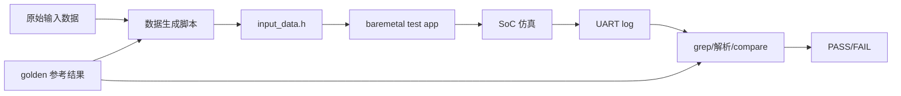

# 阶段三：如何准备自定义硬件的测试数据、构建入口和验证脚本

本文是“往 CPU 的 AXI 总线上加自定义模块”系列教程的第 3 篇。它从当前最新 `minimum_my_mxu_axu` 版本出发，总结如何为 AXI/MMIO 自定义外设准备测试数据、生成 C header、构建 baremetal app、运行仿真脚本并判断结果。

MXU、AXU、iDMA/GlobalBuffer 是本文的三个示例。后来者新增任意模块时，应复用这里的测试闭环和分步骤方法，而不是机械复制某一个模块的数据格式。

## 0. 测试阶段要解决什么问题

原始单模块 testbench 可以直接加载文件、驱动 RTL 信号、检查内部结果。接入 SoC 后，测试方式发生变化：

1. 输入数据要变成 CPU 软件可 include 的 C header。
2. CPU 通过 MMIO 把数据写入加速器 buffer。
3. CPU 写 cfg、切换 buffer ownership、启动加速器。
4. 仿真通过 UART log 输出 marker 和结果。
5. 脚本根据 UART marker 或 app 内部 compare 判断 PASS/FAIL。

对新增模块，最重要的是提前定义：输入文件格式、golden 文件格式、数据到 buffer 的映射、app 打印哪些稳定 marker、脚本如何判断通过。

## 1. 总体测试闭环、目录地图与实施顺序

本节先给出测试阶段路线图。

### 1.1 SoC 测试闭环



### 1.2 当前测试相关目录

| 路径 | 作用 |
|---|---|
| `zzc_workspace_mxu/` | MXU 原始输入、golden、格式转换和结果处理脚本 |
| `zzc_workspace_axu/` | AXU all-in-one 输入、golden 和格式转换脚本 |
| `software/app/my_mxu_test/` | MXU baremetal app 与 app.mk |
| `software/app/my_axu_test/` | AXU baremetal app 与 app.mk |
| `software/app/mxu_idma_gbuf_test/` | iDMA + GlobalBuffer + MXU buffer 集成测试 |
| `zzc_mxu_shell.sh` | MXU 一键编译和仿真脚本 |
| `zzc_axu_shell_single.sh` | AXU 单 case 编译和仿真脚本 |
| `zzc_axu_shell.sh` | AXU 全 case 循环脚本 |
| `zzc_idma_shell.sh` | iDMA + GlobalBuffer 测试脚本 |

### 1.3 MXU / AXU / iDMA 测试链路对比

| 项目 | MXU | AXU | iDMA + GlobalBuffer |
|---|---|---|---|
| workspace | `zzc_workspace_mxu` | `zzc_workspace_axu` | app 内 pattern/poison |
| golden 目录 | `gloden_result` | `golden_result` | app 内 expected |
| 生成脚本 | `gen_input_data.py` | `gen_input_data_axu.py` | 通常不需要 |
| 构建变量 | `MXU_TEST_MODE` | `AXU_TEST_CASE` | 无专用 case 变量 |
| app | `my_mxu_test` | `my_axu_test` | `mxu_idma_gbuf_test` |
| 通过 marker | `MXU_PASS` | `AXU_PASS` | `MXU_IDMA_GBUF_PASS` |
| 验证重点 | 计算正确性 | 多 case 功能正确性 | DMA master 地址可达性 |

### 1.4 新增任意模块的测试实施顺序

1. 先写一个不依赖外部数据的 smoke test：读 `STATUS`、写 `CTRL.CLR_DONE`。
2. 再写一个最小输入：只写 1 个 bank、1 个 row、2 个 64-bit word。
3. 在 app 内部写死 expected，先不引入 Python 脚本。
4. 最小 case 通过后，再定义原始输入文件格式和 golden 格式。
5. 写 `gen_input_data_my_accel.py`，生成 `input_data.h`。
6. 在 app 中 include header，完成全量输入和 golden compare。
7. 定义稳定 UART marker，例如 `MY_ACCEL_PASS` / `MY_ACCEL_FAIL`。
8. 写 shell 脚本，把 clean、make、sim、log copy、grep 串起来。
9. 最后再扩展到多 case、多模式、后仿。

### 1.5 本文后续章节如何展开

后续章节按操作顺序展开：准备数据目录、定义打包规则、生成 `input_data.h`、编写 app marker、运行单项脚本、运行全 case 或回归、确认 filelist 与 marker，最后用 checklist 和常见错误复查。

## 2. 第一步：准备原始输入数据和 golden 目录

第一步是准备原始输入和 golden。不同模块的数据来源不同，但都必须在生成 header 或运行 app 前明确。

### 2.1 MXU 数据目录

```text
zzc_workspace_mxu/
  test_data/
    int_data/
    posit_data/
  gloden_result/
  file_format_transform/
    gen_input_data.py
    log2txt_mxu.py
    compare_mxu.py
  test_result/
```

注意 MXU 目录名是 `gloden_result`，不是 `golden_result`。这是当前脚本使用的实际路径。

### 2.2 AXU 数据目录

```text
zzc_workspace_axu/
  test_data/
    axu_all_in_one_a.txt
    axu_all_in_one_b.txt
  golden_result/
    axu_all_in_one_out_reference.txt
  file_format_transform/
    gen_input_data_axu.py
```

AXU 使用标准拼写 `golden_result`。不要把 MXU 的 `gloden_result` 和 AXU 的 `golden_result` 混用。

### 2.3 iDMA + GlobalBuffer 数据来源

`mxu_idma_gbuf_test` 主要在 app 内构造 pattern 和 poison 数据，用于验证 `GlobalBuffer -> MXU WGT buffer -> GlobalBuffer` 的 DMA 往返搬运。它不是 MXU 计算正确性测试，通常不依赖大型外部 golden。

## 3. 第二步：定义数据打包规则和 buffer 映射

第二步是把原始 token 映射到硬件 buffer 的 bank、row、half64。这个规则必须同时被数据生成脚本、baremetal app 和硬件 buffer 访问方式理解。

通用 buffer offset 是：

```text
offset = (bank << 12) | (row << 4) | (half64 << 3)
```

### 3.1 MXU 打包规则

MXU 支持三种 `MXU_TEST_MODE`：

| 模式 | flow mode | data type | 说明 |
|---|---:|---:|---|
| `int_ff` | 0 | 1 | INT + feed-forward |
| `posit_ff` | 0 | 0 | POSIT + feed-forward |
| `posit_bp` | 1 | 0 | POSIT + back-propagation |

MXU 数据脚本负责把 int/posit 原始文件打包成 `MXU_WGT_DATA`、`MXU_ACT_DATA` 和 `MXU_GOLDEN_DATA`。

### 3.2 AXU 打包规则

AXU all-in-one 输入通常每行 64 个 16-bit token：

```text
bank = token_index / 8
slot = token_index % 8
slot 0..3 -> low 64-bit word
slot 4..7 -> high 64-bit word
```

也就是每行映射为 `8 bank * 2 个 64-bit word`。

### 3.3 iDMA 搬运数据规则

iDMA 测试使用 64-bit word pattern 验证地址可达性：先写 GlobalBuffer，再由 DMA 搬到 MXU WGT buffer，最后再搬回 GlobalBuffer return area。

## 4. 第三步：用生成脚本生成 `input_data.h`

第三步是把原始数据和 golden 转成 C header，让 baremetal app 能直接 include。

### 4.1 MXU 生成 header

构建 `my_mxu_test` 时，`software/app/my_mxu_test/app.mk` 会调用：

```text
zzc_workspace_mxu/file_format_transform/gen_input_data.py
```

典型命令：

```bash
cd software
make my_mxu_test MXU_TEST_MODE=posit_bp
```

生成文件：

```text
software/build/app/my_mxu_test/gen/input_data.h
```

该 header 通常包含 `MXU_WGT_DATA`、`MXU_ACT_DATA`、`MXU_GOLDEN_DATA`、模式、batch、tile base 等常量。

### 4.2 AXU 生成 header

构建 `my_axu_test` 时，`software/app/my_axu_test/app.mk` 会调用：

```text
zzc_workspace_axu/file_format_transform/gen_input_data_axu.py
```

典型命令：

```bash
cd software
make my_axu_test AXU_TEST_CASE=vpu_add
```

生成文件：

```text
software/build/app/my_axu_test/gen/input_data.h
```

如果 `AXU_TEST_CASE` 不是 `all`，`app.mk` 会增加 `-DAXU_TEST_CASE_<case>`。

### 4.3 iDMA 测试是否需要 header

`mxu_idma_gbuf_test` 当前主要在 app 内构造 pattern/poison 数据，通常不需要 `input_data.h`。如果未来 DMA 测试需要大规模输入，也可以按同样方式新增生成脚本和 header。

## 5. 第四步：在 baremetal app 中写入 buffer、启动硬件并打印 marker

第四步是在 app 中真正写 buffer、写 cfg、启动硬件，并打印稳定 marker。marker 是脚本判断结果的契约，不应随意改名。

### 5.1 MXU app marker

`my_mxu_test` 典型 marker：

```text
MXU_SOC_TEST_BEGIN
MXU_MODE ...
MXU_PASS
MXU_FAIL
MXU_SOC_TEST_END
```

历史外部 compare 链路还依赖 MXU output dump marker。如果 app 没有打印完整 output dump，则 `log2txt_mxu.py` 和 `compare_mxu.py` 无法完整工作，此时应以 app 内部 compare 输出的 `MXU_PASS` / `MXU_FAIL` 为准。

### 5.2 AXU app marker

`my_axu_test` 典型 marker：

```text
AXU_SOC_TEST_BEGIN
AXU_MODE ...
AXU_CASE name=... result=PASS/FAIL
AXU_SUMMARY total=... pass=... fail=...
AXU_PASS
AXU_FAIL
AXU_SOC_TEST_END
```

AXU 的 `sfu_rng` 包含 seed load，`nli_mish` / `nli_tanh` 包含 LUT load，reduce/scheduler 类 case 可能只比较部分 bank。

### 5.3 iDMA app marker

`mxu_idma_gbuf_test` 典型 marker：

```text
MXU_IDMA_GBUF_TEST_BEGIN
MXU_IDMA_GBUF_PASS
MXU_IDMA_GBUF_FAIL
```

这个测试验证 iDMA master 能访问 GlobalBuffer 和 MXU WGT buffer，不验证 MXU 计算正确性。

## 6. 第五步：运行单项仿真脚本并保存 UART log

第五步是运行单项脚本，并把 UART log 保存到固定位置，便于后续 grep 和排查。

### 6.1 MXU 单项脚本

```bash
./zzc_mxu_shell.sh sim
./zzc_mxu_shell.sh sim_post_syn
```

常用变量：

| 变量 | 说明 |
|---|---|
| `TEST_MODE` | 传给 `MXU_TEST_MODE`，当前默认实际为 `posit_bp` |
| `FILELIST` | 仿真使用的 SoC filelist，当前组合版本应使用 `filelist_minimum_my_mxu_axu.f` |
| `APP` | app ELF 路径，通常是 `software/build/bin/my_mxu_test` |

### 6.2 AXU 单 case 脚本

```bash
./zzc_axu_shell_single.sh vpu_add sim
./zzc_axu_shell_single.sh vpu_add sim_post_syn
```

脚本会编译 `my_axu_test AXU_TEST_CASE=<case>`，运行仿真，并复制 UART log 到 `sim/uart_logs/test_axu_<case>_uart0.log` 或 `sim_post_syn/uart_logs/test_axu_<case>_uart0.log`。

### 6.3 iDMA 单项脚本

```bash
./zzc_idma_shell.sh sim
./zzc_idma_shell.sh sim_post_syn
```

脚本运行 `mxu_idma_gbuf_test`，通过 `MXU_IDMA_GBUF_PASS` / `MXU_IDMA_GBUF_FAIL` 判断 DMA + GlobalBuffer 集成是否通过。

## 7. 第六步：运行 AXU 全 case 或完整回归

第六步是运行完整回归。当前最典型的是 AXU 全 case，因为 AXU 覆盖多个功能单元和特殊流程。

脚本：

```bash
./zzc_axu_shell.sh sim
./zzc_axu_shell.sh sim_post_syn
```

当前 case 列表：

```text
vpu_add
vpu_sub
vpu_mul
vpu_max
vpu_min
vpu_reduce_max
vpu_reduce_sum
sfu_int2posit
sfu_rng
nli_mish
nli_tanh
scheduler
```

`zzc_axu_shell.sh` 会循环调用 `zzc_axu_shell_single.sh`，对每个 case 检查 UART log 中是否存在 `AXU_PASS`。全部通过时脚本输出总 `AXU_PASS`，否则输出 `AXU_FAIL` 并返回非 0。

注意：脚本当前 `RUN_STAGE=${1:-sim_post_syn}`，但 usage 文案中写 default `sim`。遇到不一致时，以脚本实际变量为准，或在后续脚本维护中统一。

## 8. 第七步：确认脚本、app、FILELIST 和 PASS marker 匹配

第七步是确认脚本、app、SoC filelist 和 PASS marker 彼此匹配。测试脚本不只是运行 app，还隐含选择了 SoC 变体。

当前 MXU+AXU 联合版本应使用：

```text
filelist_minimum_my_mxu_axu.f
```

常见错误是：

- app 编译的是 AXU，但仿真 filelist 是旧 MXU-only。
- app 使用 `0x7002_0000` AXU 地址，但 SoC 中没有 AXU。
- 同一个地址在不同变体中含义不同，导致访问到错误外设。

因此每个一键脚本都应该明确记录：

1. 编译哪个 app。
2. 使用哪个 `FILELIST`。
3. 生成哪个 UART log。
4. grep 哪个 PASS marker。

| 测试 | app | filelist | PASS marker |
|---|---|---|---|
| MXU | `my_mxu_test` | `filelist_minimum_my_mxu_axu.f` | `MXU_PASS` |
| AXU 单 case | `my_axu_test` | `filelist_minimum_my_mxu_axu.f` | `AXU_PASS` |
| AXU 全 case | 多次 `my_axu_test` | `filelist_minimum_my_mxu_axu.f` | 总 `AXU_PASS` |
| iDMA + GlobalBuffer | `mxu_idma_gbuf_test` | `filelist_minimum_my_mxu_axu.f` | `MXU_IDMA_GBUF_PASS` |

## 9. 第八步：按照测试阶段 checklist 复查

完成数据、header、app、脚本和 filelist 后，按下面 checklist 复查：

- [ ] 数据目录路径与脚本一致。
- [ ] MXU `gloden_result` 和 AXU `golden_result` 没有混用。
- [ ] 数据打包规则与 buffer bank/row/half64 映射一致。
- [ ] `input_data.h` 能生成，并被 app include。
- [ ] app 打印稳定 BEGIN/PASS/FAIL/END marker。
- [ ] MXU 单项脚本能保存 UART log。
- [ ] AXU 单 case 脚本能保存 UART log。
- [ ] AXU 全 case 脚本逐 case grep `AXU_PASS`。
- [ ] iDMA 脚本能 grep `MXU_IDMA_GBUF_PASS`。
- [ ] app、`FILELIST`、UART log 路径和 PASS marker 匹配。
- [ ] 单项仿真通过后，再考虑全 case、后仿或更复杂回归。

## 10. 常见错误排查

### 10.1 找不到 `input_data.h`

检查 `app.mk` 是否把生成目录加入 include path，生成脚本是否执行成功，`BUILD_DIR` 是否正确。

### 10.2 MXU golden 路径找不到

检查是否误写成 `golden_result`。MXU 当前路径是 `gloden_result`。

### 10.3 AXU golden 路径找不到

检查是否误写成 `gloden_result`。AXU 当前路径是 `golden_result`。

### 10.4 AXU 编译时 case 宏不生效

检查命令是否传入 `AXU_TEST_CASE=<case>`，以及 `app.mk` 是否加入了 `-DAXU_TEST_CASE_<case>`。

### 10.5 AXU 数据行 token 数不对

AXU all-in-one 格式通常要求每行 64 个 16-bit token。少 token 或多 token 都会导致 bank/slot 映射错。

### 10.6 UART log 中没有 PASS marker

检查 app 是否真的跑到结束，是否 timeout，是否使用了正确 app，脚本 grep 的 marker 是否与 app 打印一致。

### 10.7 app 与 FILELIST 不匹配

检查运行脚本中的 `FILELIST` 是否包含当前 app 访问的外设。AXU app 必须使用包含 AXU 的 SoC 变体。

### 10.8 外部 compare 与 app 内部 compare 不一致

检查 UART dump 是否完整、log 解析脚本是否匹配当前 marker、golden 文件是否与本次 `TEST_MODE` 或 `AXU_TEST_CASE` 一致。

## 11. 本阶段结论

测试阶段的核心是建立一个可重复、可定位问题的闭环：

```text
原始数据 -> input_data.h -> app 写 MMIO/buffer -> SoC 仿真 -> UART marker -> 脚本判断
```

MXU、AXU、iDMA/GlobalBuffer 的数据格式和验收重点不同，但操作方法相同：先定义数据和 golden，再定义 buffer 映射，再生成 header，再让 app 打印稳定 marker，最后用脚本和 filelist 完成可重复验证。

后续新增任意自定义硬件时，应优先复用这种分层验证思路：先 smoke test，再最小数据，再完整 header，再单 case，最后全量脚本回归。
