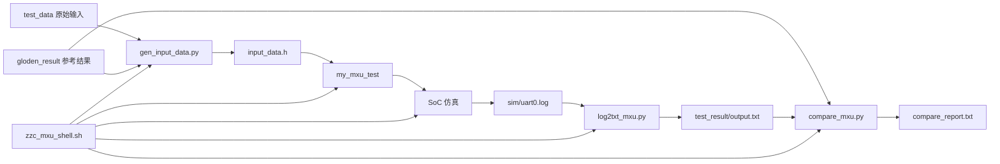

# 阶段三：如何准备 MXU 测试数据、转换脚本和一键验证脚本

本文是“往 CPU 的 AXI 总线上加自定义模块”系列教程的第 3 篇，目标是解释已经跑通的 `my_mxu` 版本中，测试数据和自动化脚本到底如何组织、如何生成 `input_data.h`、如何运行 SoC 仿真、如何判断 `int_ff`、`posit_ff`、`posit_bp` 三个样例是否通过。

当前教程以 `work_for_tapeout_2026/Soc_w_ASIC-main` 中已经验证通过的版本为事实基准。该版本已经完成：

- `int_ff` 通过，`compare_report.txt` 显示 `result: PASS`。
- `posit_ff` 通过，`compare_report.txt` 显示 `result: PASS`。
- `posit_bp` 通过，`compare_report.txt` 显示 `result: PASS`。
- 每个模式比较 `32` 行、`2048` 个 token，mismatch 为 `0`。

读本文前，建议先读：

- `如何修改hardware文件夹下的内容？.md`
- `如何修改softwareware文件夹下的内容？.md`

因为本阶段依赖前两阶段已经建立好的硬件地址契约、软件驱动和 `my_mxu_test` app。

## 0. 本阶段最终要解决什么问题

原始 MXU 单模块 testbench 可以直接在 SystemVerilog 里加载数据、驱动信号、检查结果。但接入 SoC 后，测试方式变了：

- 数据不再由单模块 testbench 直接写入 MXU 内部信号。
- 数据必须变成 CPU 软件可 include 的 C header。
- CPU 通过 MMIO 把数据写入 MXU buffer。
- 仿真输出通过 UART log 观察。
- 最终结果通过脚本和 golden 比较。

因此本阶段的目标是建立完整自动化链路：

1. 从 `zzc_workspace_mxu/test_data` 和 `gloden_result` 读取原始数据。
2. 用 `gen_input_data.py` 生成 `input_data.h`。
3. 编译 `my_mxu_test`。
4. 使用 `filelist_minimum_my_mxu.f` 运行 SoC 仿真。
5. 从 `uart0.log` 提取 MXU 输出。
6. 用 `compare_mxu.py` 和 golden 结果比较。
7. 用 `zzc_mxu_shell.sh` 一键完成以上流程。

## 1. 数据流总图



理解这张图很重要：

- `gen_input_data.py` 负责“输入数据 → C header”。
- `my_mxu_test` 负责“C header → MMIO 写 MXU → UART 输出”。
- `log2txt_mxu.py` 负责“UART log → output.txt / banks”。
- `compare_mxu.py` 负责“output.txt → 与 golden 比较”。
- `zzc_mxu_shell.sh` 负责把所有步骤串起来。

## 2. 当前跑通版本的目录结构

核心目录：

`Soc_w_ASIC-main/zzc_workspace_mxu/`

当前跑通版本中重点内容包括：

```text
zzc_workspace_mxu/
  test_data/
    posit_data/
      wgt_modified_0_0.txt
      wgt_modified_0_1.txt
      ...
      act_modified_3_1.txt
    int_data/
      wgt_modified_00.hex
      wgt_modified_01.hex
      ...
      act_modified_03.hex
  gloden_result/
    int_ff/
      mxu_out_lane0_0_0.txt
      mxu_out_lane0_0_1.txt
      ...
    posit_ff/
      mxu_out_lane0_modified_0_0.txt
      mxu_out_lane0_modified_0_1.txt
      ...
    posit_bp/
      mxu_out_lane0_modified_0_0.txt
      mxu_out_lane0_modified_0_1.txt
      ...
  file_format_transform/
    gen_input_data.py
    log2txt_mxu.py
    compare_mxu.py
  test_result/
    int_ff/
      uart0.log
      output.txt
      compare_report.txt
      banks/
    posit_ff/
      uart0.log
      output.txt
      compare_report.txt
      banks/
    posit_bp/
      uart0.log
      output.txt
      compare_report.txt
      banks/
```

注意：当前仓库目录名是 `gloden_result`，不是标准英文 `golden_result`。虽然拼写不规范，但脚本和目录已经按这个名字跑通，教程中必须按当前事实写。除非后续统一改脚本和目录，否则不要只改文档或只改目录名。

## 3. 三种测试模式

当前支持三个模式：

| 模式 | flow mode | data type | 数据来源 | golden 来源 |
|---|---:|---:|---|---|
| `int_ff` | 0 | 1 | `test_data/int_data` | `gloden_result/int_ff` |
| `posit_ff` | 0 | 0 | `test_data/posit_data` | `gloden_result/posit_ff` |
| `posit_bp` | 1 | 0 | `test_data/posit_data` | `gloden_result/posit_bp` |

对应软件配置：

- `MXU_CFG_DATA_FLOW_MODE_VALUE`
- `MXU_CFG_DATA_TYPE_MODE_VALUE`

推荐调试顺序：

1. 先跑 `int_ff`。
   - int 数据更容易人工检查。
   - 适合定位 bank、row、地址、hi/lo 错误。
2. 再跑 `posit_ff`。
   - 与 `int_ff` 同为 FF flow，主要验证 posit 数据路径。
3. 最后跑 `posit_bp`。
   - BP flow 不同，放在 FF 路线稳定之后调。

## 4. gen_input_data.py 详解

路径：

`Soc_w_ASIC-main/zzc_workspace_mxu/file_format_transform/gen_input_data.py`

这个脚本相当于早期计划中的 `txt2h_mxu.py`，但当前跑通版本实际文件名是 `gen_input_data.py`。文档和 `app.mk` 都应使用这个名字。

### 4.1 输入参数

脚本参数：

```bash
python3 gen_input_data.py \
  --mode int_ff \
  --workspace /path/to/Soc_w_ASIC-main/zzc_workspace_mxu \
  --out /path/to/software/build/app/my_mxu_test/gen/input_data.h
```

`--mode` 只允许：

- `int_ff`
- `posit_ff`
- `posit_bp`

`--workspace` 指向 `zzc_workspace_mxu`。

`--out` 指向要生成的 `input_data.h`。

### 4.2 posit 输入数据读取规则

对于 `posit_ff` 和 `posit_bp`：

- weight 来自 `test_data/posit_data/wgt_modified_<lane>_<half>.txt`
- activation 来自 `test_data/posit_data/act_modified_<lane>_<half>.txt`

其中：

- `bank = lane * 2 + half`
- `lane = bank // 2`
- `half = bank % 2`
- `bank` 范围是 0 到 7。

每一行应该有 8 个 16-bit token。脚本把 8 个 token pack 成一个 128-bit row：

- 前 4 个 token 进入 `lo64`。
- 后 4 个 token 进入 `hi64`。

### 4.3 int 输入数据读取规则

对于 `int_ff`：

- weight 来自 `test_data/int_data/wgt_modified_00.hex` 到 `wgt_modified_03.hex`。
- activation 来自 `test_data/int_data/act_modified_00.hex` 到 `act_modified_03.hex`。

当前脚本把 4 个文件放入奇数 bank：

- 文件 index 0 → bank 1。
- 文件 index 1 → bank 3。
- 文件 index 2 → bank 5。
- 文件 index 3 → bank 7。

每一行应该有 16 个 8-bit token。脚本把 16 个 token pack 成一个 128-bit row：

- 前 8 个 token 进入 `lo64`。
- 后 8 个 token 进入 `hi64`。

偶数 bank 没有输入文件时，用 0 填充。

### 4.4 golden 读取规则

对于 `posit_ff` 和 `posit_bp`，每个 bank 的 golden 文件名是：

`mxu_out_lane<lane>_modified_<lane>_<half>.txt`

例如：

- bank 0 → `mxu_out_lane0_modified_0_0.txt`
- bank 1 → `mxu_out_lane0_modified_0_1.txt`
- bank 7 → `mxu_out_lane3_modified_3_1.txt`

对于 `int_ff`，每个 bank 的 golden 文件名是：

`mxu_out_lane<lane>_<lane>_<half>.txt`

例如：

- bank 0 → `mxu_out_lane0_0_0.txt`
- bank 1 → `mxu_out_lane0_0_1.txt`
- bank 7 → `mxu_out_lane3_3_1.txt`

每个 golden 文件每行有 8 个 16-bit token。

### 4.5 生成的 input_data.h 内容

`input_data.h` 会包含：

- `MXU_TEST_MODE_NAME`
- `MXU_INPUT_BANK_COUNT = 8`
- `MXU_WGT_ROW_START = 0`
- `MXU_WGT_ROW_COUNT`
- `MXU_ACT_ROW_START = 0`
- `MXU_ACT_ROW_COUNT`
- `MXU_OUT_ROW_START = 0`
- `MXU_OUT_ROW_COUNT = 32`
- `MXU_CFG_ACT_BATCHSIZE_VALUE = 32`
- `MXU_CFG_DATA_FLOW_MODE_VALUE`
- `MXU_CFG_DATA_TYPE_MODE_VALUE`
- `MXU_CFG_WGT_TILE_BASE_VALUES[4] = {0, 4, 8, 12}`
- `MXU_CFG_ACT_TILE_BASE_VALUES[4] = {0, 8, 16, 24}`
- `MXU_CFG_OUT_TILE_BASE_VALUES[4] = {0, 8, 16, 24}`
- `MXU_WGT_DATA[row][bank][2]`
- `MXU_ACT_DATA[row][bank][2]`
- `MXU_GOLDEN_DATA[row][bank][2]`

其中 `[2]` 的约定是：

- `[0] = lo64`
- `[1] = hi64`

这个约定必须与 `my_mxu_test/main.c` 写 buffer 的顺序一致。

### 4.6 脚本检查项

当前脚本会检查：

- 每行 token 数量是否符合预期。
- mode 是否属于三种合法模式。
- token 是否能按 16 进制解析。

建议后续进一步增强：

- 检查 token 是否超过 8-bit 或 16-bit 宽度。
- 检查每个输入文件是否存在。
- 检查 golden 行数是否至少有 32 行。
- 错误信息中带上文件名和行号。

## 5. app.mk 如何调用 gen_input_data.py

路径：

`Soc_w_ASIC-main/software/app/my_mxu_test/app.mk`

关键变量：

- `MXU_TEST_MODE ?= posit_bp`
- `MXU_WS := $(ROOT_DIR)/../zzc_workspace_mxu`
- `MXU_GENDIR := $(BUILD_DIR)/app/my_mxu_test/gen`
- `MXU_GENHDR := $(MXU_GENDIR)/input_data.h`
- `MXU_GEN_SCRIPT := $(MXU_WS)/file_format_transform/gen_input_data.py`

关键规则：

```makefile
$(MXU_GENHDR): $(MXU_GEN_SCRIPT)
	@mkdir -p $(dir $@)
	python3 $(MXU_GEN_SCRIPT) --mode $(MXU_TEST_MODE) --workspace $(MXU_WS) --out $@
```

然后让 `main.c.o` 依赖 `$(MXU_GENHDR)`，并增加 include path：

```makefile
$(BUILD_DIR)/app/my_mxu_test/main.c.o: $(MXU_GENHDR)
$(BUILD_DIR)/app/my_mxu_test/main.c.o: RISCV_CCFLAGS += -I$(MXU_GENDIR)
```

这样编译 `my_mxu_test` 时会自动生成 `input_data.h`。

使用示例：

```bash
cd Soc_w_ASIC-main/software
make my_mxu_test MXU_TEST_MODE=int_ff
make my_mxu_test MXU_TEST_MODE=posit_ff
make my_mxu_test MXU_TEST_MODE=posit_bp
```

## 6. UART 输出格式

当前 `my_mxu_test/main.c` 稳定打印：

```text
MXU_SOC_TEST_BEGIN
MXU_MODE int_ff
MXU_PASS
MXU_SOC_TEST_END
```

或：

```text
MXU_SOC_TEST_BEGIN
MXU_MODE posit_bp
MXU_PASS
MXU_SOC_TEST_END
```

调试时如果打开 `dump_output_bank_files_compatible()`，会输出完整 output 区间：

```text
===MXU_OUT_BEGIN bank_count=8 row_start=0x0 row_count=32===
===MXU_OUT_BANK_BEGIN bank=0 rows=32===
row=0 0000  0000  0000  0000  0000  0000  0000  0000
...
===MXU_OUT_BANK_END bank=0===
...
===MXU_OUT_END===
```

`log2txt_mxu.py` 依赖 bank marker 和 row 格式。如果修改 `main.c` 的打印格式，必须同步修改 `log2txt_mxu.py`。

## 7. log2txt_mxu.py 详解

路径：

`Soc_w_ASIC-main/zzc_workspace_mxu/file_format_transform/log2txt_mxu.py`

作用：

- 从 `sim/uart0.log` 中解析 MXU output。
- 生成统一格式的 `output.txt`。
- 可选按 bank 拆分到 `banks/bank0.txt` 到 `banks/bank7.txt`。

### 7.1 输入参数

```bash
python3 log2txt_mxu.py \
  --in ./sim/uart0.log \
  --out ./zzc_workspace_mxu/test_result/int_ff/output.txt \
  --section MXU_OUT \
  --split-dir ./zzc_workspace_mxu/test_result/int_ff/banks
```

当前只支持：

- `--section MXU_OUT`

### 7.2 解析规则

脚本识别：

- `===MXU_OUT_BANK_BEGIN bank=<bank> rows=<rows>===`
- `===MXU_OUT_BANK_END bank=<bank>===`
- `row=<row> <8个4位hex token>`

输出 `output.txt` 中每一行格式：

```text
<bank> <row> <token0> <token1> <token2> <token3> <token4> <token5> <token6> <token7>
```

例如：

```text
0 0 0000 0000 0000 0000 0000 0000 0000 0000
```

如果没有解析到任何 record，脚本会报错：

`no MXU_OUT bank records found`

这通常表示：

- `main.c` 没有打开 output dump。
- UART log 里没有 `MXU_OUT_BANK_BEGIN` marker。
- 仿真没有跑到输出阶段。
- marker 字符串被改了。

## 8. compare_mxu.py 详解

路径：

`Soc_w_ASIC-main/zzc_workspace_mxu/file_format_transform/compare_mxu.py`

作用：

- 读取 golden 目录。
- 读取 `output.txt`。
- 按 `(bank,row,token)` 比较。
- 生成 `compare_report.txt`。
- mismatch 为 0 时 exit 0，否则 exit 1。

### 8.1 输入参数

```bash
python3 compare_mxu.py \
  --mode int_ff \
  --golden-dir ./zzc_workspace_mxu/gloden_result/int_ff \
  --output ./zzc_workspace_mxu/test_result/int_ff/output.txt \
  --report ./zzc_workspace_mxu/test_result/int_ff/compare_report.txt \
  --rows 32
```

`--mode` 只允许：

- `int_ff`
- `posit_ff`
- `posit_bp`

`--rows` 当前一键脚本使用 `32`。

### 8.2 比较规则

比较粒度：

- bank：0 到 7。
- row：0 到 `rows-1`。
- token：每 row 8 个 16-bit token。

如果 golden token 是 `x`，脚本会跳过该 token。

报告内容示例：

```text
mode: int_ff
compared_rows: 32
total_tokens: 2048
mismatches: 0
result: PASS
```

三个模式都通过时，应分别看到：

- `test_result/int_ff/compare_report.txt` 中 `result: PASS`
- `test_result/posit_ff/compare_report.txt` 中 `result: PASS`
- `test_result/posit_bp/compare_report.txt` 中 `result: PASS`

## 9. 一键脚本 zzc_mxu_shell.sh

路径：

`Soc_w_ASIC-main/zzc_mxu_shell.sh`

这个脚本把软件编译、仿真、输出提取、golden 比较串起来。

### 9.1 使用方法

```bash
cd Soc_w_ASIC-main
./zzc_mxu_shell.sh int_ff
./zzc_mxu_shell.sh posit_ff
./zzc_mxu_shell.sh posit_bp
```

如果不传参数，当前默认：

```bash
MODE=${1:-posit_ff}
```

建议调试时显式传入模式，避免误跑默认模式。

### 9.2 参数检查

脚本只允许：

- `int_ff`
- `posit_ff`
- `posit_bp`

其他参数会打印：

```text
Usage: ./zzc_mxu_shell.sh {int_ff|posit_ff|posit_bp}
```

并退出。

### 9.3 关键变量

当前脚本关键变量：

- `ROOT_DIR`：`Soc_w_ASIC-main` 根目录。
- `WS`：`zzc_workspace_mxu`。
- `RESULT_DIR`：`zzc_workspace_mxu/test_result/${MODE}`。
- `UART_LOG`：`sim/uart0.log`。
- `APP_TARGET`：默认 `my_mxu_test`。
- `APP_BIN`：默认 `../software/build/bin/${APP_TARGET}`。
- `FILELIST`：默认 `filelist_minimum_my_mxu.f`。
- `GEN_INPUT`：`file_format_transform/gen_input_data.py`。
- `LOG2TXT`：`file_format_transform/log2txt_mxu.py`。
- `COMPARE`：`file_format_transform/compare_mxu.py`。
- `GOLDEN_DIR`：`zzc_workspace_mxu/gloden_result/${MODE}`。
- `OUTPUT`：`test_result/${MODE}/output.txt`。
- `REPORT`：`test_result/${MODE}/compare_report.txt`。
- `SPLIT_DIR`：`test_result/${MODE}/banks`。

### 9.4 脚本流程

脚本执行顺序：

1. 检查 mode 合法性。
2. 计算路径变量。
3. 创建 `test_result/${MODE}`。
4. 检查 `gen_input_data.py`、`log2txt_mxu.py`、`compare_mxu.py` 是否存在。
5. 检查 golden 目录是否存在。
6. 检查 `software/app/my_mxu_test/app.mk` 是否存在。
7. 检查 `sim/filelist_minimum_my_mxu.f` 是否存在。
8. 进入 `software/`。
9. `make clean`。
10. `make my_mxu_test MXU_TEST_MODE=${MODE}`。
11. 回到根目录。
12. 删除旧 `uart0.log`、`sim/*.log`、`sim/simv`、`sim/csrc`。
13. 进入 `sim/`。
14. `make clean`。
15. `make vcs-run app=../software/build/bin/my_mxu_test FILELIST=filelist_minimum_my_mxu.f`。
16. 回到根目录。
17. 复制 `sim/uart0.log` 到 `test_result/${MODE}/uart0.log`。
18. 执行 `log2txt_mxu.py` 生成 `output.txt` 和 `banks/`。
19. 执行 `compare_mxu.py` 生成 `compare_report.txt`。
20. compare 失败则脚本返回非零。

重要前提：第 18 步要求 `uart0.log` 中包含完整 MXU_OUT bank dump。如果当前 `my_mxu_test/main.c` 只打印 `MXU_PASS` 而没有打印 `===MXU_OUT_BANK_BEGIN ...===`，`log2txt_mxu.py` 会找不到记录。重新跑一键 compare 前，要确认运行的 app 版本已经打开 output dump，或者使用已经保存好的 `test_result/<mode>/output.txt` 进行 compare。

## 10. 最终验收标准

最低验收：

- [ ] `./zzc_mxu_shell.sh int_ff` 能跑完。
- [ ] `zzc_workspace_mxu/test_result/int_ff/compare_report.txt` 生成。
- [ ] report 中 `mismatches: 0`。
- [ ] report 中 `result: PASS`。

完整验收：

- [ ] `./zzc_mxu_shell.sh int_ff` PASS。
- [ ] `./zzc_mxu_shell.sh posit_ff` PASS。
- [ ] `./zzc_mxu_shell.sh posit_bp` PASS。
- [ ] 三个模式都有 `uart0.log`。
- [ ] 三个模式都有 `output.txt`。
- [ ] 三个模式都有 `compare_report.txt`。
- [ ] 三个模式都有 `banks/bank0.txt` 到 `banks/bank7.txt`。
- [ ] 三个 report 都显示 `mismatches: 0` 和 `result: PASS`。

当前已通过版本的事实结果：

```text
int_ff:
  compared_rows: 32
  total_tokens: 2048
  mismatches: 0
  result: PASS

posit_ff:
  compared_rows: 32
  total_tokens: 2048
  mismatches: 0
  result: PASS

posit_bp:
  compared_rows: 32
  total_tokens: 2048
  mismatches: 0
  result: PASS
```

## 11. 推荐调试顺序

不要一开始同时调三种模式。推荐：

第一步：`int_ff`

- int 输入容易人工理解。
- 如果输出不对，较容易判断是地址、bank、row、half64 还是 cfg 错。

第二步：`posit_ff`

- 与 `int_ff` 同为 FF flow。
- 主要验证 posit 数据 pack、pdpu 和 golden 对齐。

第三步：`posit_bp`

- flow mode 从 0 变 1。
- 若只有它失败，优先检查 flow mode 和 BP golden。

每跑通一个模式，保留：

- `uart0.log`
- `output.txt`
- `compare_report.txt`
- `banks/`
- 对应生成的 `input_data.h`

## 12. 常见错误排查

一、`gen_input_data.py` 报 token 数量不对

检查：

- posit 输入每行是否 8 个 16-bit token。
- int 输入每行是否 16 个 8-bit token。
- 文件中是否混入了额外注释或空白字符。
- 文件路径是否读错。

二、找不到 golden 文件

检查：

- `gloden_result` 目录名是否拼对。
- mode 是否正确。
- posit 文件名是否是 `mxu_out_laneX_modified_X_Y.txt`。
- int 文件名是否是 `mxu_out_laneX_X_Y.txt`。

三、`input_data.h` 没更新

检查：

- `software/app/my_mxu_test/app.mk` 的生成规则。
- `make clean` 是否执行。
- `MXU_TEST_MODE` 是否正确传入。
- `MXU_GENHDR` 是否指向当前 build 目录。

四、仿真没有 `MXU_SOC_TEST_BEGIN`

检查：

- ELF 是否编译成功。
- `make vcs-run` 的 `app=` 是否指向正确 ELF。
- SoC 是否成功启动。
- UART log 路径是否正确。

五、`log2txt_mxu.py` 报 `no MXU_OUT bank records found`

检查：

- `main.c` 是否打开了 `dump_output_bank_files_compatible()`。
- UART log 中是否有 `===MXU_OUT_BANK_BEGIN ...===`。
- `row=` 行格式是否仍然是 8 个 4 位 hex token。
- 是否只打印了 `MXU_PASS` 而没有打印 output dump。

六、compare mismatch

检查顺序：

1. 看 `compare_report.txt` 中 first mismatches。
2. 判断是某个 bank 全错，还是所有 bank 都错。
3. 某个 bank 全错：重点查 bank 映射和 lane/half 映射。
4. 每个 bank 的 token 顺序错：重点查 pack/unpack 顺序。
5. hi/lo 颠倒：重点查 `[0]=lo64`、`[1]=hi64`。
6. 只有 row 偏移：重点查 `row_start` 和 tile base cfg。
7. 只有 `posit_bp` 错：重点查 flow mode 和 BP golden 目录。

七、`MXU_PASS` 但 compare 失败

当前 `main.c` 中内部 compare 可能被注释，因此 `MXU_PASS` 不一定等价于 golden compare PASS。最终验收应以 `compare_mxu.py` 生成的 `compare_report.txt` 为准。

八、SoC 仿真超时

检查：

- `my_mxu_wait_done` 是否 timeout。
- `STATUS.BUSY` 是否一直为 1。
- input buffer 是否写入。
- cfg 是否写完。
- ownership 是否切换。
- hardware wrapper 的 start/done 是否正确。

九、三种模式中只有 `posit_bp` 失败

优先检查：

- `mode_config("posit_bp")` 是否返回 `(1,0)`。
- `gloden_result/posit_bp` 是否存在。
- 是否误用了 `posit_ff` golden。
- 原始 BP 数据文件是否和 FF 数据共用但 golden 不同。

## 13. 与前两篇文档的关系

如果 `gen_input_data.py` 能生成 header，但软件访问 MXU 时 trap，回到：

`如何修改hardware文件夹下的内容？.md`

重点检查：

- `minimum_my_mxu` 是否接入。
- `addr_map` 是否包含 `0x70000000` 到 `0x7001FFFF` 范围。
- `filelist_minimum_my_mxu.f` 是否被仿真使用。

如果仿真能启动，但 wait done 超时或 output 不对，回到：

`如何修改softwareware文件夹下的内容？.md`

重点检查：

- `my_mxu.h` 的 base/offset。
- `mxu_buf_word_offset()`。
- `write_cfg_table()`。
- buffer ownership 切换。
- fence。

如果三个模式都 PASS，说明完整闭环已经跑通：

硬件接入 → 软件驱动 → 数据生成 → SoC 仿真 → UART 输出 → golden 比较。
