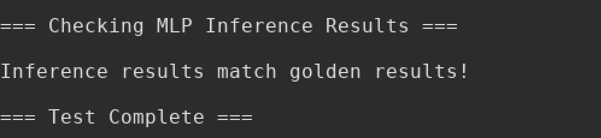

# 使用 TPU-Lite-SoC 仿真 MLP 第一层

提供了编译后的C程序，分为 6 个 hex 文件，使用 `$readmemh` 存储到 Main memory 中的前六个 Bank 中，如 [Testbench](./../src/tb/test_soc_mlp_first_layer_tb.sv) 中所示。

SoC 系统所需的 RTL 文件详见 [filelist.f](./../src/filelist.f)。

执行上述 Testbench，应该可以看到如下的输出。

